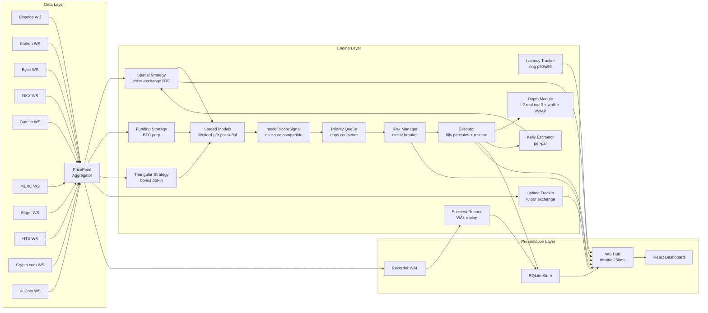

# Brecha — Motor de arbitraje BTC

Detección de arbitraje de Bitcoin en tiempo real sobre 10 exchanges, con latencia de motor sub-milisegundo, modelo estadístico de reversión a la media que prioriza spreads anómalos, profundidad sintética/real de order book con ejecución walk-the-book y fills parciales, sizing Kelly por par y backtesting determinístico.

Construido para el [Coding Challenge Mexico 2026](https://www.coding-challenge-mexico.com/challenge).

## Qué lo hace distinto

| Capacidad | Por qué importa |
|-----------|-----------------|
| **Scoring estadístico (z-score)** | El motor mantiene un estimador Welford rodante de la distribución de spread para cada par de exchanges. Las oportunidades se rankean con `0.5 × normNetPct + 0.5 × sigmoid(z)`, así el sistema prefiere un spread anómalo de 2σ antes que uno marginalmente mayor pero histórico-rutinario. Esto es lo que hace un quant fund, no un bot de retail. |
| **Multi-strategy con interfaz común** | Tres estrategias en paralelo: `spatial` (core, arb cross-exchange en BTC spot), `funding` (arb de funding rate en BTC perpetuals), `triangular` (bonus opt-in, ciclo USDT→BTC→ETH→USDT — fuera del scope estricto de "BTC arbitrage"). Mismo interfaz `Detect`, mismo heap global de scoring. |
| **Backtest determinístico** | WAL SQLite graba cada tick en vivo. El runner reproduce ventanas con seed reproducible y mide TotalPnL, Sharpe, MaxDrawdown, HitRate, ProfitFactor por strategy. Validás cambios de parámetros contra data real sin esperar mercado vivo. |
| **Latencia p50/p99 + throughput en dashboard** | Ring buffer de 1024 slots dentro del engine mide los nanosegundos de cada `ProcessUpdate`. p50/p99 y updates/seg se publican una vez por segundo a la StatusBar. El juez ve performance real, no claim de marketing. |
| **L2 real en top-3 exchanges + walk-the-book** | Binance, Bybit y OKX entregan snapshots L2 reales por WebSocket. El ejecutor camina hasta 5 niveles, acumula VWAP y produce fills parciales con `RequestedVolume` vs `Volume` cuando la liquidez no alcanza. Atomic-or-reverse: si el sell leg no matchea el buy fill, el buy se revierte exactamente al costo VWAP acumulado. |
| **Modelo de costos completo** | Cada oportunidad evalúa fees de trading, slippage, costo de withdrawal BTC (priced al buy ask) y network-latency bps por leg con escalado por edad del counterparty. Las cuatro categorías del reto aparecen en `net_profit`. |
| **Kelly sizing + correlation penalty** | Estimador Kelly per-par (Welford sobre returns realizados) limita el sizing según edge y variancia. Penalty de correlación sobre ring buffer de últimos N trades reduce volumen cuando el mismo exchange-pair se está repitiendo. |
| **Adaptive threshold** | `adaptiveMin = BaseMinNetProfitPct + AdaptiveCoeff * spreadStd` ajusta el umbral mínimo al régimen de volatilidad del par. Sube en mercados ruidosos, baja en quiet. |
| **10 exchanges, un proceso** | Binance, Kraken, Bybit, OKX, Gate.io, MEXC, Bitget, HTX, Crypto.com, KuCoin. Una goroutine por WebSocket, fan-in a un único agregador. 90 pares dirigidos disponibles para detección. |
| **Cero dependencias de matemática externa** | Welford, percentiles ring-buffer, priority queue, walk-the-book, L2 sintético, Kelly: todo escrito a mano en Go. Sin HDR histogram, sin t-digest, sin scipy. |

## Arquitectura

Tres capas en paralelo: data layer mantiene BBO por exchange, engine layer detecta y rankea oportunidades, presentation layer streamea resultados al dashboard por WebSocket.



## Las estrategias

### 1. Spatial (core, on-spec)

Arb cross-exchange puro de BTC: comprás BTC en un exchange, vendés en otro. Por cada tick entrante, el motor compara la BBO nueva contra el snapshot del resto. Modelo de costos exacto:

```
gross         = sellBid − buyAsk
buy_taker     = buyAsk  × takerFee[buyEx]
sell_taker    = sellBid × takerFee[sellEx]
slippage_buy  = buyAsk  × slippageFactor[buyEx]
withdrawal    = buyAsk  × withdrawalBTC[buyEx]
net_latency   = buyAsk  × netLatencyBps[buyEx]/1e4
              + sellBid × netLatencyBps[sellEx]/1e4 × ageFactor

net_profit    = gross − buy_taker − sell_taker − slippage_buy
              − withdrawal − net_latency
```

`ageFactor = 1 + sellAgeMs/1000`, capeado a 3×. Penaliza counterparties stale donde el precio drifteó durante el round-trip del WS.

Pasa al scoring solo si `net_profit > 0` y `net_profit / buyAsk ≥ adaptiveMin`.

### 2. Funding (BTC perpetuals)

Arb de funding rate sobre el perpetual de BTC. El activo subyacente es BTC. Entra/sale en USDT (porque los perps están denominados en USDT). Modela una distribución de funding rate per-par con SpreadModel y publica oportunidades cuando el diferencial cruza `FUNDING_THRESHOLD`.

### 3. Triangular (bonus, opt-in)

Ciclo de 3 legs intra-exchange: USDT → BTC → ETH → USDT. **Fuera del scope estricto de "BTC arbitrage"** porque incluye ETH como leg intermedio. Apagado por default. Activar con `TRIANGULAR_ENABLED=true`.

### Capa estadística (el diferenciador)

Para cada señal (cross-exchange spread, funding diff, cycle gain), el motor mantiene un `SpreadModel` que se actualiza en cada tick con Welford one-pass + ring buffer de 500 muestras.

```
spread_t = (sellBid − buyAsk) / buyAsk
μ        = running mean
σ        = running standard deviation
z        = (spread_t − μ) / σ
```

Welford da variancia numéricamente estable sobre ventana deslizante sin re-sumar en cada update. Reverse-Welford evicciona la muestra más vieja cuando el buffer está lleno.

Una vez que el modelo tiene ≥30 muestras, las oportunidades rankean con:

```
normNetPct = clip(netPct / 0.01, 0, 1)
score      = 0.5 × normNetPct + 0.5 × sigmoid(z)
```

Fallback (modelo no listo): `score = normNetPct`, `z = 0`.

Ambos términos del score están en [0, 1] para que la mezcla 50/50 sea real, no cosmética. El motor inserta en max-heap priority queue ordenada por score. Cada `EXECUTION_INTERVAL_MS`, el executor saca el top (sujeto a TTL y risk). No persigue la primera oportunidad que ve — elige la estadísticamente anómala más probable de sostenerse hasta ejecutar.

### Kelly sizing + correlation penalty

Estimador Kelly per-par lleva mean y variancia de los returns netos realizados via Welford. Genera una fracción óptima `f* = μ / σ²`, capeada a `KELLY_MAX_FRACTION`. Sustituye el viejo `MAX_POSITION_USDT / buyAsk` plano.

Ring buffer de últimos N trades trackea cuántos involucraron el mismo exchange-pair. Aplica penalty multiplicativo al sizing para evitar concentración: `1 - (matchCount/N) * CORR_PENALTY_WEIGHT`.

### Adaptive threshold

`MIN_NET_PROFIT_PCT` deja de ser fijo:

```
adaptiveMin = SPATIAL_BASE_MIN_NET_PROFIT_PCT + SPATIAL_ADAPTIVE_COEFF * spreadStd
```

En mercado tranquilo el umbral baja y captura spreads más finos. En mercado volátil sube y filtra ruido. El coeficiente determina la agresividad del ajuste.

### Walk-the-book con L2 real

BBO no alcanza para sizing realista. El executor camina el L2 book:

- **Binance, Bybit, OKX**: L2 real por WebSocket (depth20/orderbook.50/books5).
- **Resto**: L2 sintético determinístico via `internal/depth` (paso porcentual + ranges de cantidad seedeados).

```
filled, vwap, partial := walk(levels, target)
```

Si el buy leg llena 0.02 BTC al VWAP 50003.75 pero el sell leg solo puede llenar 0.015, el trade se revierte atómicamente: el executor debita el BTC recién acreditado y acredita devuelta el **costo USDT acumulado por VWAP** (no BBO × volume — ese bug filtraría unos USDT por trade fallido). `Trade.PartialFill = true` cuando `Volume < RequestedVolume`.

### Latency tracking

Ring buffer de 1024 slots dentro del engine registra los nanosegundos de cada `ProcessUpdate` (snapshot fetch + O(N) profit math + heap push). Una vez por segundo el engine publica p50/p99 + updates/seg como evento `latency_stats` por WebSocket throttled a 250 ms del lado del hub.

Implementación: `time.Since(start)` explícito en entrada/salida, sin `defer` (defer agrega ~25 ns de ruido medible en Go 1.22). Read/write protegidos por `sync.RWMutex`.

### Per-exchange uptime

El processing loop muestrea cada exchange a 1 Hz: `fresh` si `now - ReceivedAt < 10s`, `stale` si no. `internal/uptime.Tracker` acumula `fresh / total` per exchange y publica `uptime_stats`. La PriceTable renderiza el porcentaje en vivo junto al status (verde ≥95%, ambar ≥70%, rojo abajo).

### Risk management

- **Position cap** Kelly-sized o `MAX_POSITION_USDT / buyAsk` BTC.
- **Staleness cutoff**: counterparties más viejos que `STALENESS_THRESHOLD_MS` quedan fuera del loop de detección.
- **Circuit breaker**: si los últimos N trades consecutivos producen net loss ≥ `CIRCUIT_BREAKER_LOSS_PCT`, el executor pausa por `CIRCUIT_BREAKER_PAUSE_MINUTES`. Transiciones (`active → watching → paused`) visibles en el dashboard.

## Backtest engine

Sub-sistema completo de grabación + replay determinístico.

**Recorder**: WAL SQLite. Cuando `recording=true`, cada `PriceUpdate` que entra por el agregador se persiste con timestamp nano. Toggle via `POST /api/backtest/recording`.

**Runner**: lee frames del rango `from..to`, los reproduce contra las strategies seleccionadas con seed fijo y velocidad configurable (0 = max instant, 1.0 = realtime).

**Métricas computadas por strategy**:

| Métrica | Significado |
|---------|-------------|
| TotalPnL | Sumatoria neta de trades simulados |
| Sharpe | Retorno ajustado por volatilidad |
| MaxDrawdown | Pico-a-valle máximo en USDT |
| HitRate | % de trades positivos |
| ProfitFactor | Σ ganancias / Σ pérdidas |
| TradeCount | Cantidad total ejecutada |

Ejecutar desde el panel Backtest del dashboard o:

```bash
curl -X POST localhost:8088/api/backtest/recording -d '{"enabled":true}'
# esperá unos minutos para acumular data
curl -X POST localhost:8088/api/backtest/start -H 'Content-Type: application/json' \
  -d '{"from":"2026-05-30T03:30:00Z","to":"2026-05-30T04:00:00Z","speed":0,"strategies":["spatial","funding"],"seed":42}'
curl localhost:8088/api/backtest/results/<run_id>
```

## Stack técnico

| Capa | Stack |
|------|-------|
| Backend | Go 1.22, `gorilla/websocket`, `shopspring/decimal`, `modernc.org/sqlite` (sin CGO) |
| Frontend | React 18, TypeScript, Vite, Zustand, Recharts, Lucide icons |
| Storage | SQLite (un archivo, persistido entre restarts) |
| Build | Docker multi-stage (binario Go estático + bundle Vite) |

Sin wrappers HTTP, sin libs de state más allá de Zustand, sin histogramas. Stdlib + los cuatro paquetes arriba.

## Quick start (Docker)

```bash
docker compose up --build -d
```

Dashboard en `http://localhost:8088`. Los 10 connectors arrancan en paralelo, los spread models calientan en ~30 segundos (a 30 muestras), y la priority queue empieza a dequeuear oportunidades cuando se cumple el umbral.

```bash
curl -s localhost:8088/api/status        | jq
curl -s localhost:8088/api/pnl            | jq
curl -s localhost:8088/api/health         | jq
curl -s localhost:8088/api/pnl-by-pair    | jq
curl -s localhost:8088/api/pnl-by-strategy| jq
```

## Correr local sin Docker

```bash
# Backend
cp .env.example .env
go run ./cmd/server
# En otra terminal
cd web && npm install && npm run dev
```

Backend en `:8080`, frontend dev en `:5173`. Vite proxea `/api` y `/ws` al backend.

## Configuración

Todos los parámetros son env vars con defaults razonables. Los más relevantes para demos:

| Variable | Default | Propósito |
|----------|---------|-----------|
| `DEMO_MODE` | `false` | Si `true`, el TweaksPanel permite editar fees en vivo. Las fees por default ya son las retail reales. |
| `MIN_NET_PROFIT_PCT` | `0.0015` | Umbral mínimo (legacy; ahora se usa principalmente `SPATIAL_BASE_MIN_NET_PROFIT_PCT`). |
| `MAX_POSITION_USDT` | `1000` | Cap por trade cuando Kelly aún no calienta. |
| `EXECUTION_INTERVAL_MS` | `100` | Cada cuánto dequeuea el executor. |
| `OPPORTUNITY_TTL_MS` | `500` | Vida del opp en el heap. |
| `STALENESS_THRESHOLD_MS` | `2000` | Counterparties más viejos se descartan. |
| `DEPTH_LEVELS` | `5` | Niveles por lado del L2 sintético. |
| `DEPTH_STEP_PCT` | `0.0001` | Paso de precio por nivel. |
| `DEPTH_MIN_QTY_BTC` | `0.005` | Cantidad mínima por nivel. |
| `DEPTH_MAX_QTY_BTC` | `0.025` | Cantidad máxima por nivel. |
| `CIRCUIT_BREAKER_N` | `5` | Trades evaluados para racha de pérdidas. |
| `CIRCUIT_BREAKER_LOSS_PCT` | `-0.005` | Threshold de P&L de la racha para pausar. |
| `INITIAL_USDT_PER_EXCHANGE` | `10000` | Balance inicial simulado USDT. |
| `INITIAL_BTC_PER_EXCHANGE` | `0.1` | Balance inicial simulado BTC. |
| `DATA_DIR` | `./data` | Ubicación SQLite. |
| `SPATIAL_BASE_MIN_NET_PROFIT_PCT` | `0.0015` | Threshold base de la strategy spatial. |
| `SPATIAL_ADAPTIVE_COEFF` | `1.0` | Multiplicador de `spreadStd` para el adaptive threshold. |
| `KELLY_MIN_SAMPLES` | `10` | Muestras mínimas antes de que Kelly empiece a sizear. |
| `KELLY_MAX_FRACTION` | `0.25` | Cap superior del Kelly fraction. |
| `CORR_WINDOW_N` | `50` | Tamaño del ring buffer de correlation penalty. |
| `CORR_PENALTY_WEIGHT` | `0.3` | Intensidad del penalty cuando se repite un par. |
| `TRIANGULAR_ENABLED` | `false` | Activa la strategy triangular (bonus opt-in fuera del scope BTC-only). |
| `FUNDING_ENABLED` | `true` | Activa la strategy funding sobre BTC perpetuals. |

En demo mode, el TweaksPanel del dashboard edita cualquier campo de fees en vivo via `PATCH /api/config`, incluyendo costo de withdrawal per-exchange y network-latency bps.

## Exchanges, fees y canales

Las fees por default reflejan las retail reales de cada venue. Editables en vivo desde el TweaksPanel o `PATCH /api/config` para explorar escenarios alternativos.

| Exchange | Taker fee | Withdrawal | Net-lat (bps) | WebSocket channel | L2 real |
|----------|----------:|-----------:|--------------:|-------------------|--------:|
| Binance | 0.10 % | 0.00020 BTC | 1 | `btcusdt@bookTicker` + `depth20@100ms` | ✓ |
| Kraken | 0.26 % | 0.00005 BTC | 2 | v1 ticker array (XBT/USDT) | — |
| Bybit | 0.10 % | 0.00050 BTC | 2 | `orderbook.50.BTCUSDT` | ✓ |
| OKX | 0.10 % | 0.00040 BTC | 2 | `tickers` + `books5:BTC-USDT` | ✓ |
| Gate.io | 0.20 % | 0.00050 BTC | 3 | `spot.book_ticker BTC_USDT` | — |
| MEXC | 0.20 % | 0.00050 BTC | 3 | `spot@public.bookTicker.v3.api@BTCUSDT` | — |
| Bitget | 0.10 % | 0.00030 BTC | 2 | `books1 BTCUSDT_SPBL` | — |
| HTX | 0.20 % | 0.00010 BTC | 3 | `market.btcusdt.bbo` (gzip) | — |
| Crypto.com | 0.25 % | 0.00006 BTC | 2 | `ticker.BTC_USDT` | — |
| KuCoin | 0.10 % | 0.00050 BTC | 3 | `/market/ticker:BTC-USDT` | — |

El connector layer normaliza 10 formas distintas de mensaje en un único `types.PriceUpdate`. Cada parser está extraído a un método `parseMessage(msg) (PriceUpdate, bool)` cubierto por tests con frames de ejemplo. Reconexiones usan backoff exponencial capeado a 60 s.

## Dashboard

En vivo en el browser:

- **StatusBar**: estado circuit-breaker, P&L total, win rate, conteo de trades, conexión WS, **latencia p50/p99 de detección**, **throughput del engine (updates/s)**
- **Top Opportunity Banner**: tarjeta de un vistazo con el top-scoring activo (auto-hide a los 5 s sin opp)
- **PriceTable**: BBO por exchange con flash en bid/ask, spread %, indicador de freshness, **uptime % de sesión**, y **highlight best-bid/cheapest-ask** (bordes verde/naranja mostrando el delta de arbitraje en el header)
- **SpreadChart**: z-score sobre ventana deslizante de 60 s para los 4 pares más activos, con bandas de referencia ±1σ y ±2σ. Selector de pares manual + colores estables por par (hash) + warm-up indicator hasta 30 muestras
- **OpportunityFeed**: lista streaming con net %, badge de z-score, barra de score (gradiente + glow cuando ≥0.5) y status badges
- **TradeHistory**: breakdown completo de costos (gross, fees, slippage, net) + columna de strategy + unidad de volumen correcta per-strategy (BTC para spatial, USDT para funding/triangular) + **badge de partial-fill** cuando `Volume < RequestedVolume`
- **PnLChart**: área de P&L acumulado
- **SpreadHeatmap**: matriz 10×10 de spreads cross-exchange en vivo, coloreada por signo y magnitud, con **flash en celda por cada trade ejecutado** (verde = profit, rojo = loss)
- **PerPairPnL**: barra horizontal rankeando los top pares por P&L acumulado
- **StrategyPnL**: agregado de P&L por strategy (spatial vs funding vs triangular)
- **BacktestPanel**: form para correr replays + tabla de resultados + historial de runs
- **TweaksPanel** (demo mode): editor de config en vivo incluyendo fees per-exchange, withdrawal cost y network bps
- **ReconnectBanner**: surface estado WS-desconectado con tiempo transcurrido y backoff exponencial

## Tests

```bash
go test ./... -race
cd web && npx tsc --noEmit && npm run build
```

Todos los paquetes pasan con race detector. El frontend type-checkea y bundlea limpio. 44 tests de UI cubren OpportunityFeed, SpreadChart, TradeHistory, PriceTable, StatusBar, PnLChart, useMarketSocket.

Coverage del backend se enfoca en math del engine (modelo de costos con las cuatro categorías), spread model (corrección de Welford, eviction reverse-Welford), módulo depth (generación determinística, walk-the-book VWAP, fills parciales), executor (reversal atomic-or-nothing con costo VWAP acumulado, adversarialmente testeado), risk manager (transiciones circuit-breaker), latency tracker (matemática exacta de percentiles), uptime tracker (acumulación race-free), aggregator (drain, snapshot, fan-out no-bloqueante), handlers `/api/health`, `/api/pnl-by-pair`, `/api/pnl-by-strategy`, parseMessage de los 10 connectors, backtest recorder + runner, y sizing Kelly.

## APIs REST y WebSocket

Spec completa OpenAPI 3.0 en [`openapi.yaml`](openapi.yaml). El WebSocket en `/ws` transporta:

| Evento | Throttle | Payload |
|--------|---------:|---------|
| `price_update` | 250 ms | `{exchange, bid, ask}` |
| `price_snapshot` | 5 s, sin throttle | `{<exchange>: {exchange, bid, ask}}` |
| `spread_stats` | 250 ms | `[{Pair, Mean, Std, Samples}]` |
| `opportunity` | inmediato | `Opportunity` completo |
| `trade_executed` | inmediato | `Trade` completo (con `PartialFill`, `RequestedVolume`, `strategy`) |
| `pnl_update` | inmediato | `{total_pnl, trade_count, win_rate}` |
| `circuit_breaker` | inmediato | `{state}` |
| `latency_stats` | 250 ms | `{p50_us, p99_us, samples, updates_per_sec}` |
| `uptime_stats` | 250 ms | `{<exchange>: pct}` |

Endpoints REST destacados:

| Método | Path | Uso |
|--------|------|-----|
| GET | `/api/status` | Estado del sistema |
| GET | `/api/health` | Health check (L2 disponibilidad, parse latency) |
| GET | `/api/pnl` | Resumen de P&L |
| GET | `/api/pnl-by-pair` | P&L agregado por exchange pair |
| GET | `/api/pnl-by-strategy` | P&L por strategy (spatial / funding / triangular) |
| GET | `/api/spreads` | Snapshot de los SpreadModels |
| GET | `/api/trades` | Historial completo de trades |
| GET | `/api/opportunities` | Opps por status |
| GET/PATCH | `/api/config` | Configuración en vivo |
| POST | `/api/backtest/recording` | Toggle grabación |
| POST | `/api/backtest/start` | Iniciar replay |
| GET | `/api/backtest/status` | Estado del run actual |
| GET | `/api/backtest/runs` | Historial de runs |
| GET | `/api/backtest/results/{id}` | Métricas de un run |

## Estructura del proyecto

```
cmd/server/         entry point + processing loop
internal/
  backtest/         runner determinístico + replay clock
  depth/            L2 sintético + walk-the-book + VWAP
  engine/           coordinador + priority queue + latency tracker
  exchange/         10 connectors WS + tests de parseMessage
  executor/         executors per-strategy (spatial / funding / triangular)
  feed/             agregador fan-in
  metrics/          LatencyTracker compartido
  model/            SpreadModel Welford + ScoreSignal helper
  recorder/         WAL SQLite de PriceUpdates
  risk/             circuit breaker + position caps
  server/           hub WS + REST API + handlers
  sizing/           Kelly estimator
  store/            persistencia SQLite (payload JSON backward-compat)
  strategy/
    spatial/        cross-exchange BTC arb (core)
    funding/        funding-rate arb BTC perp
    triangular/     ciclo 3-leg (bonus opt-in)
  types/            PriceUpdate, Opportunity, Trade, OrderBookLevel
  uptime/           tracker uptime per-exchange
  wallet/           balances simulados
config/             configuración por env
web/                dashboard React + Vite
openspec/           artefactos SDD: proposals, specs, designs, tasks, verify reports
openapi.yaml        contrato REST OpenAPI 3.0
```

## Decisiones de diseño clave

- **Go para el backend**: una goroutine por WebSocket sin contención de GIL; binario único para deployar.
- **Processing loop single-goroutine**: cada `PriceUpdate` fluye por un `select`. Sin contención de mutex en priority queue, ring de latencia o uptime tracker. Concurrencia en el data layer, serialización en el engine.
- **Welford sobre variancia batch**: evita re-sumar 500 muestras en cada update.
- **Ring buffer para latencia**: cero deps, percentiles exactos, sorteable en ~8 µs una vez por segundo. HDR histogram y t-digest considerados y rechazados como overkill.
- **L2 real solo en top-3 + sintético en el resto**: implementar L2 subscriptions en los 10 connectors hubiera sido una semana para marginal accuracy. El paquete `internal/depth` genera un book estadísticamente realista con `rand.Source` seedeado — testeable y determinístico en tests.
- **Atomic-or-nothing partial fills**: ante fill asimétrico, el trade se revierte usando el costo VWAP acumulado del buy. La alternativa (escalar ambos legs hacia abajo) dejaría BTC residual y complicaría accounting.
- **WS hub throttled**: `price_update`, `spread_stats`, `latency_stats`, `uptime_stats` colapsan al último valor cada 250 ms. `opportunity`, `trade_executed`, `circuit_breaker`, `pnl_update` se entregan inmediato. Dashboard responsivo sin floodear el browser.
- **modernc.org/sqlite**: SQLite puro-Go (sin CGO) para que la imagen Docker quede chica y cross-buildee sin C toolchain.
- **`shopspring/decimal` en todo el cost model**: aritmética float está prohibida. La frontera float64 es solo el wallet manager y el `time.Since(start).Float64()` para reporte de latencia.
- **TDD estricto + disciplina SDD**: cada cambio del cost model tiene un test RED verificado antes de la implementación. Cada test load-bearing es adversarial: el test de reversal del executor usa un book multi-nivel donde VWAP ≠ BBO, así un reversal buggy que acredite BBO × volume filtraría un monto medible.
- **Triangular off por default**: ciclo USDT→BTC→ETH→USDT incluye ETH, fuera del scope estricto "BTC arbitrage". Queda como bonus opt-in (`TRIANGULAR_ENABLED=true`) para evaluadores que quieran ver multi-strategy en acción sin que viole la spec del reto.

## Licencia

MIT.
