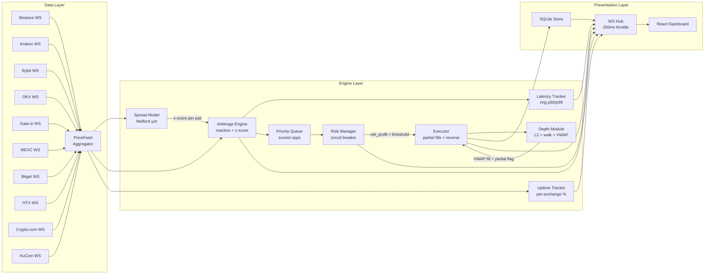

# BTC Arbitrage Bot

Real-time Bitcoin arbitrage detection across 10 exchanges with sub-millisecond engine latency, a statistical mean-reversion model that prioritises anomalous spreads, and synthetic order-book depth with walk-the-book partial fills.

Built for the [Coding Challenge Mexico 2026](https://www.coding-challenge-mexico.com/challenge).

## What makes this different

| Capability | Why it matters |
|------------|----------------|
| **Statistical scoring (z-score)** | The engine maintains a Welford rolling estimator of the spread distribution for every exchange pair. Opportunities are scored by `0.6 × net_pct + 0.4 × sigmoid(z)`, so the system prefers a 2σ-anomalous spread over a marginally larger but historically routine one. This is what quant funds do, not what retail bots do. |
| **Detection latency p50/p99 + throughput in the dashboard** | A 1024-slot ring buffer inside the engine measures the nanoseconds spent in every `ProcessUpdate` call. p50/p99 and updates-per-second are pushed to the StatusBar once per second. The jury sees actual engine performance, not a marketing claim. |
| **Synthetic order-book depth + partial fills** | The executor walks an L2 book (5 levels per side), accumulates a volume-weighted average fill price, and produces partial fills with `RequestedVolume` vs `Volume` when liquidity is insufficient. Atomic-or-reverse semantics: if the sell side can't match the buy fill, the buy is reversed at the exact VWAP cost. |
| **Complete cost model** | Every opportunity is evaluated against trading fees, slippage factor, BTC withdrawal cost (priced at the buy ask) and per-leg network-latency basis points. The reto's four cost categories all appear in `net_profit`. |
| **10 exchanges, one process** | Binance, Kraken, Bybit, OKX, Gate.io, MEXC, Bitget, HTX, Crypto.com, KuCoin — one goroutine per WebSocket, fan-in to a single aggregator. 90 directed pairs available for arbitrage detection. |
| **Per-exchange uptime + per-pair P&L** | The dashboard surfaces session uptime % per exchange (sampled every second from price freshness) and a horizontal bar ranking of which exchange pairs produced the most P&L. |
| **Live demo tweaks panel** | A demo-mode panel lets evaluators edit fees per exchange (taker, slippage, withdrawal, network bps), change `min_net_profit_pct`, adjust the staleness threshold, and trigger circuit-breaker scenarios live, without restarting the bot. |
| **Zero external math dependencies** | Welford running variance, ring-buffer percentiles, the priority queue, the walk-the-book algorithm and the synthetic L2 generator are all hand-rolled in Go. No HDR histogram, no t-digest, no scipy. |

## Architecture

Three layers run in parallel: a data layer that maintains BBO per exchange, an engine layer that detects and scores arbitrage opportunities, and a presentation layer that streams results to the dashboard over WebSocket.



## The detection strategy

The bot competes on signal quality, not on raw speed. Two modes operate simultaneously.

### Reactive mode (baseline)

For every incoming price tick, the engine compares the new BBO against every other exchange in the snapshot. The cost model is exact, not a generic 0.1%:

```
gross         = sellBid − buyAsk
buy_taker     = buyAsk  × takerFee[buyEx]
sell_taker    = sellBid × takerFee[sellEx]
slippage_buy  = buyAsk  × slippageFactor[buyEx]
withdrawal    = buyAsk  × withdrawalBTC[buyEx]
net_latency   = buyAsk  × netLatencyBps[buyEx]/1e4
              + sellBid × netLatencyBps[sellEx]/1e4

net_profit    = gross − buy_taker − sell_taker − slippage_buy
              − withdrawal − net_latency
```

Opportunities pass to the scoring layer only if `net_profit > 0` and `net_profit / buyAsk ≥ MIN_NET_PROFIT_PCT`.

### Statistical layer (the differentiator)

For each exchange pair `(buy, sell)` the engine maintains a `SpreadModel` that updates on every tick using a one-pass Welford estimator with a ring buffer of the last 500 samples:

```
spread_t = (sellBid − buyAsk) / buyAsk
μ        = running mean
σ        = running standard deviation
z        = (spread_t − μ) / σ
```

Welford gives numerically stable variance over a sliding window without re-summing on every update. Reverse-Welford evicts the oldest sample when the buffer is full.

Once the model has ≥100 samples, opportunities are scored by:

```
score = 0.6 × net_pct + 0.4 × sigmoid(z)
```

Opportunities are inserted into a max-heap priority queue ordered by score. Every `EXECUTION_INTERVAL_MS`, the executor dequeues the top item (subject to TTL and risk checks). This means the bot does not chase the first opportunity it sees — it picks the statistically anomalous one most likely to be sustained long enough to execute.

### Walk-the-book execution

Top-of-book BBO is not realistic for sizing. The `internal/depth` package synthesises an L2 book around each BBO snapshot:

```
ask_levels[i] = bboAsk × (1 + STEP_PCT × i),   qty ~ U(MIN_QTY, MAX_QTY)
bid_levels[i] = bboBid × (1 − STEP_PCT × i),   qty ~ U(MIN_QTY, MAX_QTY)
```

The randomness is deterministic via an injected `rand.Source` (testable). The executor calls `depth.Walk` on each leg:

```
filled, vwap, partial := walk(levels, target)
```

If the buy leg fills 0.02 BTC at VWAP 50003.75 but the sell leg can only fill 0.015, the trade is atomically reversed: the executor debits the BTC just credited and credits back the **VWAP-accumulated USDT cost** (not BBO × volume — that bug would leak a few USDT per failed trade). `Trade.PartialFill` is true whenever `Volume < RequestedVolume`.

### Latency tracking

A 1024-slot ring buffer inside the engine records the nanoseconds spent in each `ProcessUpdate` call (snapshot fetch + O(N) profit math + heap push). Once per second the engine publishes p50/p99 + updates-per-second as a `latency_stats` WebSocket event throttled at 250ms hub-side.

Implementation: explicit `time.Since(start)` at function entry and exit, no `defer` to keep the measurement clean (defer adds ~25 ns of measurable noise on Go 1.22). Read/write are protected by `sync.RWMutex` so a future REST `/api/latency` endpoint can read without contention.

### Per-exchange uptime

The processing loop samples every exchange at 1 Hz: `fresh` if `now - ReceivedAt < 10s`, `stale` otherwise. The `internal/uptime.Tracker` accumulates `fresh / total` per exchange and publishes a `uptime_stats` event. The PriceTable renders the live percentage next to each row's status (green ≥95 %, amber ≥70 %, red below).

### Risk management

- **Position cap** per opportunity: `MAX_POSITION_USDT / buyAsk` BTC.
- **Staleness cutoff**: any counterparty price older than `STALENESS_THRESHOLD_MS` is excluded from the detection loop.
- **Circuit breaker**: if the last N consecutive trades produce a net loss ≥ `CIRCUIT_BREAKER_LOSS_PCT`, the executor pauses for `CIRCUIT_BREAKER_PAUSE_MINUTES`. State transitions (`active → watching → paused`) are visible in the dashboard.

## Tech stack

| Layer | Stack |
|-------|-------|
| Backend | Go 1.22, `gorilla/websocket`, `shopspring/decimal`, `modernc.org/sqlite` (CGO-free) |
| Frontend | React 18, TypeScript, Vite, Zustand, Recharts |
| Storage | SQLite (single file, persisted across restarts) |
| Build | Docker multi-stage (static Go binary + Vite bundle) |

No HTTP client wrappers, no React state libraries beyond Zustand, no histogram libraries. Stdlib + the four packages above.

## Quick start (Docker)

```bash
docker compose up --build -d
```

Dashboard at `http://localhost:8088`. The 10 exchange connectors come up in parallel, the spread models warm up in ~30 seconds, and the priority queue starts dequeuing opportunities once `MIN_NET_PROFIT_PCT` is satisfied.

```bash
curl -s localhost:8088/api/status        | jq
curl -s localhost:8088/api/pnl            | jq
curl -s localhost:8088/api/health         | jq
curl -s localhost:8088/api/pnl-by-pair    | jq
```

## Run locally without Docker

```bash
# Backend
cp .env.example .env
go run ./cmd/server
# in another terminal
cd web && npm install && npm run dev
```

Backend on `:8080`, frontend dev server on `:5173`. The Vite dev server proxies `/api` and `/ws` to the backend.

## Configuration

All parameters are environment variables with sensible defaults. The most useful ones for demos:

| Variable | Default | Purpose |
|----------|---------|---------|
| `DEMO_MODE` | `true` | Loads `DemoFees` (favourable, makes opportunities visible). Set `false` for real retail fees. |
| `MIN_NET_PROFIT_PCT` | `0.0000` | Minimum net profit to enqueue an opportunity. Raise to `0.0015` to be selective. |
| `MAX_POSITION_USDT` | `1000` | Cap per simulated trade. |
| `EXECUTION_INTERVAL_MS` | `100` | How often the executor dequeues. |
| `OPPORTUNITY_TTL_MS` | `500` | Heap expiry for an opportunity. |
| `STALENESS_THRESHOLD_MS` | `2000` | Drop counterparties older than this. |
| `DEPTH_LEVELS` | `5` | Levels per side of the synthetic book. |
| `DEPTH_STEP_PCT` | `0.0001` | Per-level price step (each level 0.01 % worse). |
| `DEPTH_MIN_QTY_BTC` | `0.005` | Lower bound of per-level qty. |
| `DEPTH_MAX_QTY_BTC` | `0.025` | Upper bound of per-level qty. |
| `CIRCUIT_BREAKER_N` | `5` | Trades evaluated for the loss streak. |
| `CIRCUIT_BREAKER_LOSS_PCT` | `-0.005` | Streak P&L threshold to pause. |
| `INITIAL_USDT_PER_EXCHANGE` | `10000` | Simulated starting USDT balance. |
| `INITIAL_BTC_PER_EXCHANGE` | `0.1` | Simulated starting BTC balance. |
| `DATA_DIR` | `./data` | SQLite location. |

In demo mode, the TweaksPanel in the dashboard lets you edit any fee field live via `PATCH /api/config`, including per-exchange withdrawal cost and network-latency basis points.

## Exchanges, fees and channels

Demo-mode fees are tuned so partial fills and z-score signals stay visible during a demo. Real retail fees are the second column.

| Exchange | Demo fee | Real fee | Withdrawal | Net-lat (bps) | WebSocket channel |
|----------|---------:|---------:|-----------:|--------------:|-------------------|
| Binance | 0.001 % | 0.10 % | 0.00020 BTC | 1 | `btcusdt@bookTicker` |
| Kraken | 0.001 % | 0.26 % | 0.00005 BTC | 2 | v1 ticker array (XBT/USDT) |
| Bybit | 0.001 % | 0.10 % | 0.00050 BTC | 2 | `orderbook.1.BTCUSDT` |
| OKX | 0.001 % | 0.10 % | 0.00040 BTC | 2 | `tickers BTC-USDT` |
| Gate.io | 0.001 % | 0.20 % | 0.00050 BTC | 3 | `spot.book_ticker BTC_USDT` |
| MEXC | 0.001 % | 0.20 % | 0.00050 BTC | 3 | `spot@public.bookTicker.v3.api@BTCUSDT` |
| Bitget | 0.001 % | 0.10 % | 0.00030 BTC | 2 | `books1 BTCUSDT_SPBL` |
| HTX | 0.001 % | 0.20 % | 0.00010 BTC | 3 | `market.btcusdt.bbo` (gzip) |
| Crypto.com | 0.001 % | 0.25 % | 0.00006 BTC | 2 | `ticker.BTC_USDT` |
| KuCoin | 0.001 % | 0.10 % | 0.00050 BTC | 3 | `/market/ticker:BTC-USDT` |

The connector layer normalises 10 different message shapes into a single `types.PriceUpdate`. Each parser is extracted to a testable `parseMessage(msg) (PriceUpdate, bool)` method covered by sample-frame unit tests. Reconnects use exponential backoff capped at 60 seconds.

## Dashboard

Live in the browser:

- **StatusBar**: circuit-breaker state, total P&L, win rate, trade count, WS connection state, **detect p50/p99 latency**, **engine throughput (updates/s)**
- **Top Opportunity Banner**: at-a-glance card of the current top-scoring active opportunity (auto-hides after 5 s without one)
- **PriceTable**: BBO per exchange with bid/ask flash on change, spread %, freshness indicator, **session uptime %**, and **best-bid/cheapest-ask highlight** (green/orange borders showing the live arbitrage delta in the header)
- **SpreadChart**: z-score over a 60-second sliding window for the 3 most-active pairs, with ±1σ and ±2σ reference bands and a warm-up indicator until 100 samples
- **OpportunityFeed**: streaming list with net %, z-score badge, score bar (gradient + glow when ≥0.5), and status badges
- **TradeHistory**: full cost breakdown (gross, fees, slippage, net) plus **partial-fill badge** when `Volume < RequestedVolume`
- **PnLChart**: cumulative P&L area chart
- **SpreadHeatmap**: 10×10 matrix of live cross-exchange spreads, colored by sign and magnitude, with a **cell flash on every executed trade** (green = profit, red = loss)
- **PerPairPnL**: horizontal bar ranking the top 8 exchange pairs by total session P&L
- **TweaksPanel** (demo mode only): live config editor including per-exchange fees, withdrawal cost and network bps
- **ReconnectBanner**: surfaces WS-disconnected state with elapsed time and exponential-backoff indicator

## Tests

```bash
go test ./... -race
cd web && npx tsc --noEmit && npm run build
```

109 Go tests across 14 packages pass with the race detector. The frontend type-checks and bundles cleanly.

Coverage focuses on the engine math (cost model with all four cost categories), the spread model (Welford correctness, reverse-Welford eviction), the **depth module** (deterministic level generation, walk-the-book VWAP, partial fills), the **executor** (atomic-or-nothing reversal with VWAP-accumulated cost, adversarially tested), the risk manager (circuit-breaker transitions), the **latency tracker** (exact percentile math on deterministic input), the **uptime tracker** (race-free fresh/stale accumulation), the **feed aggregator** (drain, snapshot, fan-out non-blocking), the **/api/health and /api/pnl-by-pair handlers**, and **parseMessage for all 10 exchange connectors**.

## REST and WebSocket APIs

The full OpenAPI 3.0 spec is at [`openapi.yaml`](openapi.yaml). The WebSocket at `/ws` carries:

| Event | Throttle | Payload |
|-------|---------:|---------|
| `price_update` | 250 ms | `{exchange, bid, ask}` |
| `price_snapshot` | 5 s, unthrottled | `{<exchange>: {exchange, bid, ask}}` |
| `spread_stats` | 250 ms | `[{Pair, Mean, Std, Samples}]` |
| `opportunity` | immediate | Full `Opportunity` |
| `trade_executed` | immediate | Full `Trade` (with `PartialFill`, `RequestedVolume`) |
| `pnl_update` | immediate | `{total_pnl, trade_count, win_rate}` |
| `circuit_breaker` | immediate | `{state}` |
| `latency_stats` | 250 ms | `{p50_us, p99_us, samples, updates_per_sec}` |
| `uptime_stats` | 250 ms | `{<exchange>: pct}` |

## Project structure

```
cmd/server/         binary entry point + processing loop
internal/
  depth/            synthetic L2 + walk-the-book + VWAP
  engine/           arbitrage engine, priority queue, latency tracker
  exchange/         10 WebSocket connectors + parseMessage tests
  executor/         simulated execution + walk-the-book + reversal
  feed/             fan-in aggregator
  model/            Welford spread model
  risk/             position limits + circuit breaker
  server/           WebSocket hub + REST API + handlers
  store/            SQLite persistence (backward-compatible JSON payload)
  types/            PriceUpdate, Opportunity, Trade, OrderBookLevel
  uptime/           per-exchange uptime tracker
  wallet/           simulated balances
config/             env-driven configuration
web/                React + Vite dashboard
openspec/           SDD artifacts: proposals, specs, designs, tasks, verify reports
openapi.yaml        OpenAPI 3.0 REST contract
```

## Key design decisions

- **Go for the backend**: goroutines per WebSocket without GIL contention; single-binary deploy.
- **Single-goroutine processing loop**: every `PriceUpdate` flows through one `select`. No mutex contention on the priority queue, the latency ring or the uptime tracker. Concurrency is at the data layer, serialisation at the engine.
- **Welford over batch variance**: avoids re-summing 500 samples on every update.
- **Ring buffer for latency**: zero dependencies, exact percentiles, sortable in ~8 µs once per second. HDR histogram and t-digest considered and rejected as overkill.
- **Synthetic depth, not real L2 subscriptions**: rewriting 10 connectors to subscribe to L2 snapshots would have been a week of work for marginal accuracy gain in the simulator. The `internal/depth` package generates a statistically realistic book with a seeded `rand.Source` — fully testable and fully deterministic in tests.
- **Atomic-or-nothing partial fills**: on asymmetric fill (buy got more than sell can match), the trade is reversed using the VWAP-accumulated buy cost. The alternative — scaling both legs down — would leave residual BTC on the buy exchange and complicate accounting.
- **Throttled WS hub**: `price_update`, `spread_stats`, `latency_stats`, `uptime_stats` collapse to the latest value every 250 ms. `opportunity`, `trade_executed`, `circuit_breaker`, `pnl_update` are delivered immediately. Keeps the dashboard responsive without flooding the browser.
- **modernc.org/sqlite**: pure-Go SQLite (no CGO) so the Docker image stays small and cross-builds without a C toolchain.
- **`shopspring/decimal` everywhere**: float arithmetic is forbidden in the cost model. Money is decimal. The float64 boundary is only the wallet manager and the `time.Since(start).Float64()` call for latency reporting.
- **Strict TDD + SDD discipline**: every cost-model change has a RED test that was verified to fail before the implementation. Every load-bearing test is adversarial: the executor reversal test uses a multi-level book where VWAP ≠ BBO so a buggy reversal that credits BBO × volume would leak a measurable amount.

## License

MIT
