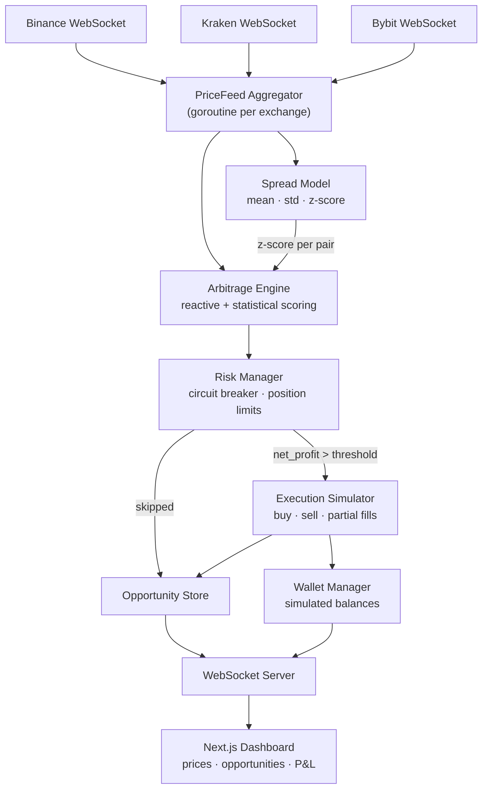

# BTC Arbitrage Bot

Real-time Bitcoin arbitrage detection and simulated execution across multiple exchanges, with a live web dashboard.

Built for the [Coding Challenge Mexico 2026](https://www.coding-challenge-mexico.com/challenge).

## Architecture

The system runs three layers in parallel: a data layer that maintains live order books per exchange, an engine layer that detects and scores arbitrage opportunities, and a presentation layer that streams results to the dashboard.



### Detection strategy

The engine operates in two modes simultaneously.

**Reactive detection** compares the best bid and ask across all exchange pairs on every price tick. If a spread is profitable after fees and slippage, it enters the pipeline.

**Statistical scoring** layers a mean-reverting spread model on top. For each exchange pair, the engine maintains a rolling window of spread history and calculates a z-score. Opportunities with a high z-score, meaning the spread is statistically anomalous relative to its history, are prioritized over plain reactive hits. The model activates after approximately 30 minutes of data collection.

This shifts the bot from competing on raw speed to competing on signal quality.

## Tech Stack

| Layer | Technology |
|-------|-----------|
| Backend | Go, gorilla/websocket, shopspring/decimal |
| Frontend | Next.js 14, React, Zustand, Recharts |
| Backend deploy | Railway |
| Frontend deploy | Vercel |

## Getting Started

### Prerequisites

- Go 1.22+
- Node.js 20+
- pnpm

### Run the backend

```bash
cp .env.example .env
go run ./cmd/server
```

### Run the frontend

```bash
cd web
pnpm install
pnpm dev
```

The dashboard will be available at `http://localhost:3000`. The backend runs on `http://localhost:8080`.

## Configuration

Copy `.env.example` to `.env` and adjust as needed.

| Variable | Default | Description |
|----------|---------|-------------|
| `PORT` | `8080` | Backend port |
| `MIN_NET_PROFIT_PCT` | `0.0015` | Minimum net profit to consider an opportunity (0.15%) |
| `MAX_POSITION_USDT` | `1000` | Max position size per trade in USDT |
| `EXECUTION_INTERVAL_MS` | `100` | How often the engine dequeues the top opportunity |
| `OPPORTUNITY_TTL_MS` | `500` | Max age of an opportunity before it expires |
| `STALENESS_THRESHOLD_MS` | `2000` | Price feed age before it is considered stale |
| `WINDOW_SIZE` | `500` | Spread model rolling window size |
| `MIN_SAMPLES` | `100` | Minimum samples before the statistical model activates |
| `CIRCUIT_BREAKER_N` | `5` | Number of trades to evaluate for the circuit breaker |
| `CIRCUIT_BREAKER_LOSS_PCT` | `-0.005` | P&L threshold that triggers the circuit breaker |
| `CIRCUIT_BREAKER_PAUSE_MINUTES` | `5` | How long the circuit breaker pauses execution |
| `INITIAL_USDT_PER_EXCHANGE` | `10000` | Starting simulated USDT balance per exchange |
| `INITIAL_BTC_PER_EXCHANGE` | `0.1` | Starting simulated BTC balance per exchange |

## Exchanges

| Exchange | Taker fee | WebSocket stream |
|----------|-----------|-----------------|
| Binance | 0.10% | `btcusdt@bookTicker` |
| Kraken | 0.26% | `ticker` (XBT/USDT) |
| Bybit | 0.10% | `orderbook.1.BTCUSDT` |

## Dashboard

The dashboard shows in real time:

- Live BBO per exchange with connection status and staleness indicator
- Opportunity feed with net profit, z-score, and execution status
- Trade history with full cost breakdown
- Cumulative P&L chart
- Spread z-score chart per exchange pair, with ±1σ and ±2σ bands
- Detection latency (p50 and p95)
- Circuit breaker status

## Project Structure

```
cmd/server/          main entry point
internal/
  exchange/          WebSocket connectors (one per exchange)
  feed/              PriceFeed Aggregator
  model/             Spread Model (Welford online statistics)
  engine/            Arbitrage Engine + priority queue
  executor/          Execution Simulator
  risk/              Risk Manager + circuit breaker
  wallet/            Wallet Manager
  store/             Opportunity and trade store
  server/            WebSocket server to frontend
config/              Configuration loader
web/                 Next.js frontend
```

## License

MIT
