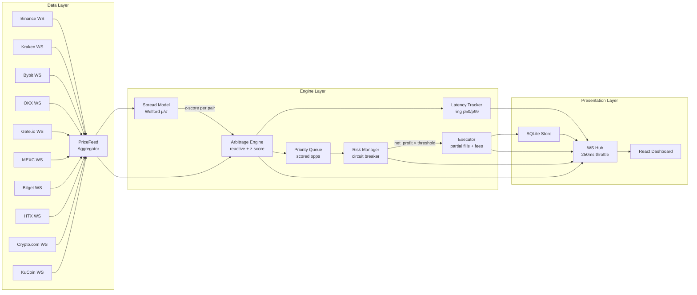

# BTC Arbitrage Bot

Real-time Bitcoin arbitrage detection across 10 exchanges, with sub-millisecond engine latency and a statistical mean-reversion model that prioritises anomalous spreads over plain reactive hits.

Built for the [Coding Challenge Mexico 2026](https://www.coding-challenge-mexico.com/challenge).

## What makes this different

| Capability | Why it matters |
|------------|----------------|
| **Statistical scoring (z-score)** | The engine maintains a rolling Welford estimator of the spread distribution for every exchange pair. Opportunities are scored by `0.6 × net_pct + 0.4 × sigmoid(z)`, so the system prefers a 2σ-anomalous spread over a marginally larger but historically routine one. This is what quant funds do, not what retail bots do. |
| **Detection latency p50/p99 in the dashboard** | A 1024-slot ring buffer inside the engine measures the elapsed time of every `ProcessUpdate` call. p50/p99 are computed by copy-and-sort once per second and pushed to the StatusBar. The jury sees actual engine performance, not a marketing claim. |
| **10 exchanges, one process** | Binance, Kraken, Bybit, OKX, Gate.io, MEXC, Bitget, HTX, Crypto.com, KuCoin — one goroutine per WebSocket, fan-in to a single aggregator. 45 directed pairs available for arbitrage detection. |
| **Live demo tweaks panel** | A dev-mode panel lets evaluators edit fees per exchange, change `min_net_profit_pct`, adjust the staleness threshold, and trigger circuit breaker scenarios live, without restarting the bot. |
| **Zero external math dependencies** | Welford running variance, ring-buffer percentiles, and the priority queue are all hand-rolled in Go. No HDR histogram, no t-digest, no scipy. The code shows how the math works. |

## Architecture

Three layers run in parallel: a data layer that maintains BBO per exchange, an engine layer that detects and scores arbitrage opportunities, and a presentation layer that streams results to the dashboard over WebSocket.



## The detection strategy

The bot competes on signal quality, not on raw speed. Two modes operate simultaneously.

### Reactive mode (baseline)

For every incoming price tick, the engine compares the new BBO against every other exchange in the snapshot. The cost model is exact, not a generic 0.1%:

```
gross       = sellBid − buyAsk
buy_cost    = buyAsk × takerFee[buy_exchange]
sell_cost   = sellBid × takerFee[sell_exchange]
slippage    = buyAsk × slippageFactor[buy_exchange]
net_profit  = gross − buy_cost − sell_cost − slippage
```

Opportunities pass to the scoring layer only if `net_profit > 0` and `net_pct ≥ MIN_NET_PROFIT_PCT`.

### Statistical layer (the differentiator)

For each exchange pair `(buy, sell)`, the engine maintains a `SpreadModel` that updates on every tick using a one-pass Welford estimator with a ring buffer of the last 500 samples:

```
spread_t = (sellBid − buyAsk) / buyAsk
μ = running mean
σ = running standard deviation
z = (spread_t − μ) / σ
```

Welford gives numerically stable variance over a sliding window without re-summing on every update. Reverse-Welford evicts the oldest sample when the buffer is full.

Once the model has ≥100 samples (the warm-up phase), opportunities are scored by:

```
score = 0.6 × net_pct + 0.4 × sigmoid(z)
```

Opportunities are inserted into a max-heap priority queue ordered by score. Every `EXECUTION_INTERVAL_MS`, the executor dequeues the top item (subject to TTL and risk checks). This means the bot does not chase the first opportunity it sees — it picks the statistically anomalous one most likely to be sustained long enough to execute.

### Latency tracking

Inside the engine, a 1024-slot ring buffer records the nanoseconds spent in each `ProcessUpdate` call (snapshot fetch + O(N) profit math + heap push). Once per second the engine publishes p50/p99 as a `latency_stats` WebSocket event throttled at 250ms hub-side. The dashboard renders `detect p50: X.Xµs | p99: Y.Yµs` in the StatusBar.

Implementation: explicit `time.Since(start)` at function entry and exit, no `defer` to keep the measurement clean (defer adds ~25ns of measurable noise on Go 1.22). Read/write are protected by `sync.RWMutex` so a future REST `/api/latency` endpoint can read without contention.

### Risk management

- **Position cap** per opportunity: `MAX_POSITION_USDT / buyAsk` BTC.
- **Staleness cutoff**: any counterparty price older than `STALENESS_THRESHOLD_MS` is excluded from the detection loop.
- **Circuit breaker**: if the last N consecutive trades produce loss ≥ `CIRCUIT_BREAKER_LOSS_PCT`, the executor pauses for `CIRCUIT_BREAKER_PAUSE_MINUTES`. State transitions (`active → watching → paused`) are visible in the dashboard.

## Tech stack

| Layer | Stack |
|-------|-------|
| Backend | Go 1.22, `gorilla/websocket`, `shopspring/decimal`, `modernc.org/sqlite` (CGO-free) |
| Frontend | React 18, TypeScript, Vite, Zustand, Recharts |
| Storage | SQLite (single file, persisted across restarts) |
| Build | Docker multi-stage (static Go binary + Vite bundle) |

No HTTP client wrappers, no React state libraries beyond Zustand, no histogram libraries. Stdlib + the four packages above.

## Quick start (Docker)

The fastest way to evaluate the bot. Requires Docker.

```bash
docker compose up --build -d
```

Dashboard at `http://localhost:8088`. The 10 exchange connectors come up in parallel, the spread models warm up in ~30 seconds, and the priority queue starts dequeuing opportunities once `MIN_NET_PROFIT_PCT` is satisfied.

To inspect live state:

```bash
curl -s localhost:8088/api/status | jq
curl -s localhost:8088/api/pnl    | jq
```

## Run locally without Docker

```bash
# Backend
cp .env.example .env
go run ./cmd/server
# in another terminal
cd web && npm install && npm run dev
```

Backend on `:8080`, frontend dev server on `:5173`. The Vite dev server proxies `/api` and `/ws` to the backend.

## Configuration

All parameters are environment variables with sensible defaults. The most useful ones for demos:

| Variable | Default | Purpose |
|----------|---------|---------|
| `DEMO_MODE` | `true` | Loads `DemoFees` (favourable, makes opportunities visible). Set `false` for real retail fees. |
| `MIN_NET_PROFIT_PCT` | `0.0000` | Minimum net profit to enqueue an opportunity. Raise to `0.0015` to be selective. |
| `MAX_POSITION_USDT` | `1000` | Cap per simulated trade. |
| `EXECUTION_INTERVAL_MS` | `100` | How often the executor dequeues. |
| `OPPORTUNITY_TTL_MS` | `500` | Heap expiry for an opportunity. |
| `STALENESS_THRESHOLD_MS` | `2000` | Drop counterparties older than this. |
| `CIRCUIT_BREAKER_N` | `5` | Trades evaluated for the loss streak. |
| `CIRCUIT_BREAKER_LOSS_PCT` | `-0.005` | Streak P&L threshold to pause. |
| `INITIAL_USDT_PER_EXCHANGE` | `10000` | Simulated starting USDT balance. |
| `INITIAL_BTC_PER_EXCHANGE` | `0.1` | Simulated starting BTC balance. |
| `DATA_DIR` | `./data` | SQLite location. |

In demo mode, the TweaksPanel in the dashboard lets you edit any of these live via `PATCH /api/config`, including per-exchange taker fees and slippage factors. Changes take effect on the next tick.

## Exchanges and fees

Demo-mode fees are tuned to make arbitrage visible during a demo. Real retail fees are the second column.

| Exchange | Demo fee | Real fee | WebSocket channel |
|----------|---------:|---------:|-------------------|
| Binance | 0.02% | 0.10% | `btcusdt@bookTicker` |
| Kraken | 0.05% | 0.26% | `book-10 BTC/USDT` |
| Bybit | 0.02% | 0.10% | `orderbook.1.BTCUSDT` |
| OKX | 0.02% | 0.10% | `books5:BTC-USDT` |
| Gate.io | 0.04% | 0.20% | `spot.book_ticker BTC_USDT` |
| MEXC | 0.00% | 0.00% | `spot@public.bookTicker.v3.api BTCUSDT` |
| Bitget | 0.02% | 0.10% | `books5 BTCUSDT_SPBL` |
| HTX | 0.04% | 0.20% | `market.btcusdt.bbo` |
| Crypto.com | 0.04% | 0.25% | `book.BTC_USDT.10` |
| KuCoin | 0.02% | 0.10% | `/market/level2:BTC-USDT` |

The connector layer normalises 10 different message shapes into a single `types.PriceUpdate`. Reconnects use exponential backoff capped at 30 seconds.

## Dashboard

Live in the browser:

- **StatusBar**: circuit breaker state, total P&L, win rate, trade count, WS connection, **detect p50/p99 latency**
- **PriceTable**: BBO per exchange with bid/ask flash on change, spread %, freshness indicator
- **SpreadChart**: z-score over a 60-second sliding window for the 3 most-active pairs, with ±1σ and ±2σ reference bands, warm-up indicator until 100 samples
- **OpportunityFeed**: streaming list with net%, z-score, score, and status badges
- **TradeHistory**: full cost breakdown (gross, fees, slippage, net)
- **PnLChart**: cumulative P&L area chart
- **TweaksPanel** (demo mode only): live config editor including per-exchange fees

## Tests

```bash
go test ./... -race
cd web && npx tsc --noEmit && npm run build
```

64 Go tests across 12 packages pass with the race detector. The frontend type-checks and bundles cleanly.

Coverage focuses on the engine math, the spread model (Welford correctness, reverse-Welford eviction), the executor (partial fills, balance updates), the risk manager (circuit breaker transitions), and the latency tracker (exact percentile math on deterministic input). Coverage of the exchange connector parsers is intentionally light — those are sample-frame fixtures and would be a follow-up.

## Project structure

```
cmd/server/         binary entry point + processing loop
internal/
  exchange/         10 WebSocket connectors + reconnect logic
  feed/             fan-in aggregator
  model/            Welford spread model
  engine/           arbitrage engine, priority queue, latency tracker
  executor/         simulated execution + wallet updates
  risk/             position limits + circuit breaker
  wallet/           simulated balances
  store/            SQLite persistence
  server/           WebSocket hub + REST API
config/             env-driven configuration
web/                React + Vite dashboard
openspec/           SDD artifacts: proposals, specs, designs, tasks, verify reports
```

## Key design decisions

- **Go for the backend**: goroutines per WebSocket without GIL contention; single-binary deploy.
- **Single-goroutine processing loop**: every `PriceUpdate` flows through one `select`. No mutex contention on the priority queue or the latency ring. Concurrency is at the data layer, serialisation at the engine.
- **Welford over batch variance**: avoids re-summing 500 samples on every update.
- **Ring buffer for latency**: zero dependencies, exact percentiles, sortable in ~8µs once per second. HDR histogram and t-digest considered and rejected as overkill.
- **Throttled WS hub**: `price_update`, `spread_stats`, `latency_stats` collapse to the latest value every 250ms. `opportunity` and `trade_executed` are delivered immediately. Keeps the dashboard responsive without flooding the browser.
- **modernc.org/sqlite**: pure-Go SQLite (no CGO) so the Docker image stays small and cross-builds without a C toolchain.
- **`shopspring/decimal` everywhere**: float arithmetic is forbidden in the cost model. Money is decimal.

## License

MIT
