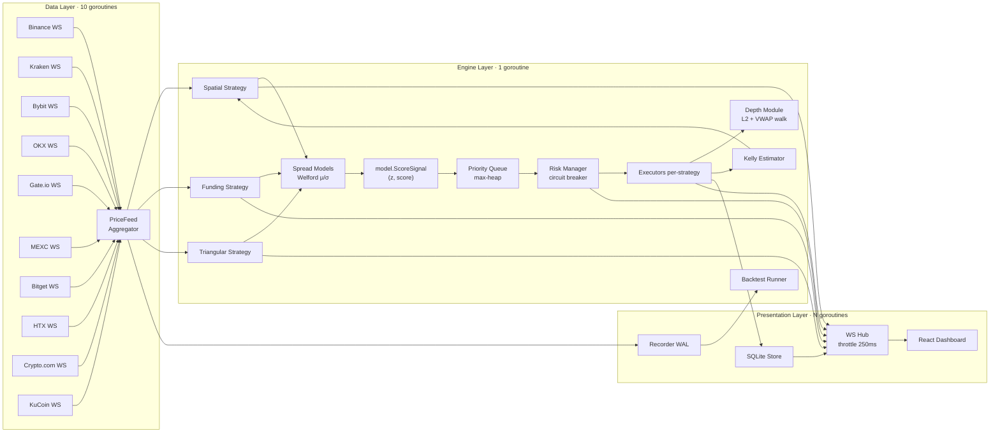
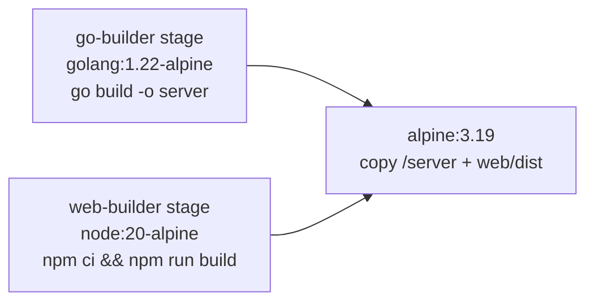

# Arquitectura

Brecha está construido como tres capas concurrentes: data layer ingresa precios, engine layer detecta y rankea oportunidades, presentation layer las streamea al dashboard. Todo corre en un único proceso Go con un único binario.

## Vista global



## Capas

### 1. Data layer

Cada exchange tiene una goroutine dedicada que mantiene un WebSocket conectado y normaliza mensajes en un `types.PriceUpdate` uniforme:

```go
type PriceUpdate struct {
    Exchange   string
    Bid, Ask   decimal.Decimal
    BidSize    decimal.Decimal
    AskSize    decimal.Decimal
    ReceivedAt time.Time
}
```

Los 10 connectors viven en `internal/exchange/`. Cada uno implementa `parseMessage(msg []byte) (PriceUpdate, bool)` testeable. Reconexiones usan exponential backoff capeado a 60 segundos.

El **Aggregator** (`internal/feed/aggregator.go`) funciona como fan-in: lee de un canal compartido al que los 10 connectors publican, mantiene un `map[exchange]PriceUpdate` con el último BBO y expone `Snapshot()` para el engine y `Updates()` (canal) para el processing loop.

### 2. Engine layer

Una única goroutine corre el **processing loop** principal en `cmd/server/main.go`. En cada update entrante:

1. Recibe `PriceUpdate` del agregador.
2. Si recording está activado, lo escribe a WAL SQLite (`internal/recorder`).
3. Llama `eng.ProcessUpdate(u)` que **fanouts** a cada strategy registrada.
4. Cada strategy devuelve un slice de `Opportunity` que se pushea al heap.
5. Cada `EXECUTION_INTERVAL_MS` (default 100ms), el loop hace `eng.DequeueTop()` y rutea al executor correspondiente.

```mermaid
sequenceDiagram
    participant Conn as Exchange WS
    participant Agg as Aggregator
    participant Loop as Processing Loop
    participant Eng as Engine.ProcessUpdate
    participant Strats as Strategies (3)
    participant PQ as Priority Queue
    participant RM as Risk Manager
    participant Exec as Executor
    participant Store as SQLite Store
    participant Hub as WS Hub

    Conn->>Agg: PriceUpdate(bid, ask)
    Agg->>Loop: update via channel
    Loop->>Eng: ProcessUpdate(u)
    Eng->>Strats: Detect(u, snapshot, now)
    Strats-->>Eng: []Opportunity
    Eng->>PQ: heap.Push for each opp

    Note over Loop: every EXECUTION_INTERVAL_MS
    Loop->>Eng: DequeueTop()
    Eng-->>Loop: top opp
    Loop->>RM: Evaluate(opp)
    alt accepted
        Loop->>Exec: Execute(opp)
        Exec->>Store: SaveTrade
        Exec->>Hub: trade_executed
    else rejected
        Loop->>Store: opp.Status=skipped
        Loop->>Hub: circuit_breaker (if paused)
    end
    Loop->>Hub: opportunity (with final status)
```

#### Componentes del engine

| Componente | Archivo | Responsabilidad |
|------------|---------|-----------------|
| `Engine` | `internal/engine/engine.go` | Fan-out a strategies, max-heap priority queue, latency ring buffer. |
| `SpatialStrategy` | `internal/strategy/spatial/spatial.go` | Detección cross-exchange (BTC spot). |
| `FundingStrategy` | `internal/strategy/funding/funding.go` | Detección de diferencial de funding rate. |
| `TriangularStrategy` | `internal/strategy/triangular/triangular.go` | Detección de ciclos intra-exchange (USDT→BTC→ETH→USDT). |
| `SpreadModel` | `internal/model/spread.go` | Welford + ring buffer 500 muestras. |
| `model.ScoreSignal` | `internal/model/spread.go` | Helper compartido `(z, score)` por strategy. |
| `RiskManager` | `internal/risk/risk.go` | Circuit breaker + position caps. |
| `Depth` | `internal/depth/depth.go` | L2 sintético + walk-the-book + VWAP. |
| `KellyEstimator` | `internal/sizing/kelly.go` | Welford de returns realizados por par. |
| `LatencyTracker` | `internal/metrics/latency.go` | Ring buffer 1024 slots para p50/p99 de ProcessUpdate. |

### 3. Presentation layer

#### Store

`internal/store/store.go` envuelve SQLite con `modernc.org/sqlite` (pure-Go, sin CGO). Persiste:
- `trades` — historial completo, recargado al boot.
- `opportunities` — para el endpoint `/api/opportunities`.
- `runs` — backtest runs y sus métricas.
- `frames` — el recorder WAL (separate table en la misma DB).

#### WebSocket Hub

`internal/server/ws.go` mantiene la lista de clientes conectados y publica eventos. Algunos eventos están **throttled** (collapse al último valor cada 250ms) para no flooder el browser:

```go
var throttledTypes = map[string]bool{
    "price_update":  true,
    "spread_stats":  true,
    "latency_stats": true,
    "uptime_stats":  true,
}
```

Eventos críticos (`opportunity`, `trade_executed`, `circuit_breaker`, `pnl_update`) van inmediato.

#### Recorder + Backtest

`internal/recorder/recorder.go` escribe cada `PriceUpdate` (cuando `recording=true`) a una WAL SQLite. `internal/backtest/runner.go` los reproduce contra las strategies con un `ReplayClock` que avanza determinísticamente. Métricas computadas: TotalPnL, Sharpe, MaxDrawdown, HitRate, ProfitFactor, TradeCount por strategy.

Ver `docs/backtest.md` para el detalle.

## Modelo de concurrencia

```
Goroutine                       Owner                     Comunicación
─────────────────────────────────────────────────────────────────────
main                            cmd/server                Signal handling, setup
processing-loop                 cmd/server                Único consumidor del heap.
ws-connector × 10               internal/exchange         Cada uno escribe al canal del aggregator.
aggregator-drain                internal/feed             Drena canal, mantiene snapshot.
ws-hub                          internal/server           Atiende N clientes WS.
hub-throttler                   internal/server           1 timer por throttled type.
funding-tick                    internal/strategy/funding Refresca synthetic rates.
http-handlers                   internal/server           Goroutine por request HTTP.
backtest-run                    internal/backtest         Cuando hay un run activo.
```

Reglas:
- **Single-writer**: el processing loop es el único que escribe al heap. Sin contención.
- **Read-many**: `Aggregator.Snapshot()` devuelve copia, multiple readers OK.
- **Mutex per-component**: `RiskManager`, `LatencyTracker`, `UptimeTracker`, `SpreadModel` cada uno tiene su mutex propio.
- **No defer en hot paths**: `time.Since(start)` explícito en entrada y salida de `ProcessUpdate` evita los ~25ns de overhead de defer.

## Build y deploy

### Imagen Docker (multi-stage)



Tamaño final ~15 MB. No CGO, no toolchain en runtime.

### Endpoints embedded

El binario sirve:
- `/api/*` — REST handlers en `internal/server/api.go`.
- `/ws` — WebSocket hub.
- `/*` (cualquier otro path) — SPA estática desde `web/dist` (embedida con `//go:embed`).

## Tests

```bash
go test ./... -race
```

Coverage por paquete:

| Paquete | Qué testea |
|---------|------------|
| `internal/model` | Welford correctness (mean/std vs batch), reverse-Welford eviction, `IsReady` boundary, `ScoreSignal` formula. |
| `internal/strategy/spatial` | Detección, modelo de costos (4 categorías), z-score, Kelly, correlation penalty, adaptive threshold, imbalance penalty. |
| `internal/strategy/funding` | Detección de diferencial, cooldown, training del modelo, scoring. |
| `internal/strategy/triangular` | Cycle math, scoring, modelo per-exchange. |
| `internal/engine` | Fan-out, heap order, TTL expiry, latency tracking. |
| `internal/depth` | Generación L2 determinística, walk-the-book VWAP, partial fills. |
| `internal/executor` | Atomic-or-nothing reversal con VWAP-accumulated cost (adversarial). |
| `internal/risk` | Transiciones circuit breaker (active → watching → paused). |
| `internal/metrics` | Percentiles exactos en datos determinísticos. |
| `internal/uptime` | Acumulación race-free fresh/stale. |
| `internal/feed` | Drain, snapshot, fan-out no-bloqueante. |
| `internal/exchange` | `parseMessage` por connector contra frames de ejemplo. |
| `internal/recorder` | Persistencia WAL + readback. |
| `internal/backtest` | Runner determinístico, ReplayClock, métricas. |
| `internal/sizing` | Kelly estimator + capping. |
| `internal/server` | Handlers REST + hub WS + throttling. |
| `internal/store` | CRUD + migrations. |

44 tests adicionales en frontend (`web/src/**/*.test.tsx`) cubren los paneles principales.
