# Backtest engine

Subsistema completo de grabación + replay determinístico. Permite reproducir cualquier ventana de mercado real contra las strategies y obtener métricas cuantitativas reproducibles.

El recorder arranca **encendido por default** desde el server (`recordingEnabled.Store(true)` al boot en `cmd/server/main.go`). Cada `PriceUpdate` que entra al agregador queda persistido en la WAL SQLite. Para apagarlo (no recomendado salvo si la DB crece demasiado), usar `POST /api/backtest/recording` con `{"enabled": false}`.

El panel del dashboard `BacktestPanel` está visible en el bottom del dashboard. Permite lanzar replays directo desde la UI.

## Por qué existe

Tres motivos concretos:

1. **Validar cambios sin esperar live data**. Cambiás un coeficiente y corrés backtest contra los últimos 30 minutos reales → ves cómo hubiese performado.
2. **Comparar strategies entre sí**. Mismo período, mismo seed, contraste directo de Sharpe, drawdown, hit rate.
3. **Determinismo para tuning de parámetros**. Mismo seed + mismas grabaciones = mismo resultado. A/B test de parámetros sin variancia de mercado.

## Componentes

```mermaid
flowchart LR
    AGG[Aggregator] -->|"si recording=true"| REC["Recorder<br/>WAL SQLite"]
    REC -->|"frames + funding_rates"| DB[("data.db")]

    DB -->|"SELECT rango"| CLOCK["ReplayClock<br/>determinístico"]
    CLOCK -->|"frames en orden"| RUN["BacktestRunner"]
    RUN -->|"snapshot()"| STRATS["Spatial / Funding / Triangular<br/>factories nuevas"]
    STRATS -->|"opportunities"| HEAP["Priority Queue"]
    HEAP -->|"DequeueTop"| EXEC["Executor simulado"]
    EXEC -->|"trades"| METRICS["Metrics computer<br/>Sharpe / DD / Hit / PF"]
    METRICS -->|"BacktestRun"| STORE[("runs table")]
```



### Recorder

`internal/recorder/recorder.go`. Cuando `recording=true` (toggle via `POST /api/backtest/recording`), cada `PriceUpdate` que entra al agregador se escribe a una tabla `frames` en la SQLite con timestamp en nanos.

Esquema:

```sql
CREATE TABLE frames (
    id          INTEGER PRIMARY KEY AUTOINCREMENT,
    ts_nano     INTEGER NOT NULL,
    exchange    TEXT NOT NULL,
    bid         TEXT NOT NULL,
    ask         TEXT NOT NULL,
    bid_size    TEXT,
    ask_size    TEXT
);
CREATE INDEX idx_frames_ts ON frames(ts_nano);
```

Modo WAL de SQLite (`PRAGMA journal_mode=WAL`) para writes concurrentes sin bloquear reads.

### ReplayClock

`internal/backtest/clock.go`. Implementa `types.Clock` pero con tiempo controlado por la corrida del runner. Avanza al `ts_nano` del próximo frame, no a wall-clock.

Permite que strategies basadas en `now` (ej. cooldowns) se comporten igual en replay que en vivo, sin race conditions.

### Runner

`internal/backtest/runner.go`. Orquesta:

1. Lee `frames` del rango `from..to` ordenados por `ts_nano`.
2. Crea instancias nuevas (factories) de cada strategy seleccionada con el seed pasado.
3. Para cada frame:
   - Avanza el clock.
   - Inyecta el `PriceUpdate` al agregador interno.
   - Llama `ProcessUpdate` (igual que la corrida real).
4. Al final, computa métricas sobre el slice de trades resultante.
5. Persiste el run con `MetricsJSON`.

`speed` parameter:
- `0`: ejecuta sin sleep entre frames. Máxima velocidad.
- `1.0`: respeta el delta entre `ts_nano` consecutivos. Realtime.
- `>1`: realtime / speed. Útil para slow-motion debug.

### Métricas computadas

`internal/backtest/metrics.go`. Por strategy:

| Métrica | Fórmula |
|---------|---------|
| **TotalPnL** | `Σ NetProfit` de todos los trades de la strategy. |
| **Sharpe** | `(mean_return / std_return) × √(periods_per_year)`. Asume returns como fracciones netas. |
| **MaxDrawdown** | Pico-a-valle máximo del cumulative P&L. En USDT absolutos. |
| **HitRate** | `wins / total_trades`. |
| **ProfitFactor** | `Σ ganancias / |Σ pérdidas|`. >1 es rentable. |
| **TradeCount** | Total de trades de esa strategy. |

---

## Uso

### Recording

Está **encendido por default**. Cada tick se persiste. Para apagar (no recomendado):

```bash
curl -X POST localhost:8088/api/backtest/recording \
  -H 'Content-Type: application/json' \
  -d '{"enabled": false}'
```

Re-encender:

```bash
curl -X POST localhost:8088/api/backtest/recording -d '{"enabled": true}'
```

### Lanzar un replay

```bash
curl -X POST localhost:8088/api/backtest/start \
  -H 'Content-Type: application/json' \
  -d '{
    "from": "2026-05-30T21:30:00Z",
    "to":   "2026-05-30T22:00:00Z",
    "speed": 0,
    "strategies": ["spatial", "funding", "triangular"],
    "seed": 42
  }'
```

Respuesta:

```json
{ "run_id": "31f12c00-bd46-4610-b429-a9404f3ce57d" }
```

### Poll del progreso

```bash
curl localhost:8088/api/backtest/status
```

```json
{ "state": "running", "progress": 0.45, "current_ts": ..., "run_id": "..." }
```

Cuando termina:

```json
{ "state": "done", "progress": 1.0, "current_ts": ..., "run_id": "..." }
```

### Métricas del run

```bash
curl localhost:8088/api/backtest/results/31f12c00-bd46-4610-b429-a9404f3ce57d
```

```json
{
  "run_id": "31f12c00...",
  "started_at": "2026-05-30T22:00:00Z",
  "ended_at":   "2026-05-30T22:00:03Z",
  "from":       "2026-05-30T21:30:00Z",
  "to":         "2026-05-30T22:00:00Z",
  "status":     "done",
  "metrics": {
    "spatial": {
      "TotalPnL":     145.23,
      "Sharpe":       2.1,
      "MaxDrawdown":  12.5,
      "HitRate":      0.94,
      "ProfitFactor": 3.2,
      "TradeCount":   89
    },
    "funding": {
      "TotalPnL":     520.50,
      "Sharpe":       3.8,
      "MaxDrawdown":  4.2,
      "HitRate":      1.0,
      "ProfitFactor": 99999.0,
      "TradeCount":   12
    }
  }
}
```

### Historial de runs

```bash
curl localhost:8088/api/backtest/runs
```

---

## Loop completo de uso

```bash
# 1. Activar grabación
curl -X POST localhost:8088/api/backtest/recording -d '{"enabled": true}'

# 2. Esperar ~30 minutos (o el período que querés analizar)
sleep 1800

# 3. Lanzar replay sobre los últimos 30 min
NOW=$(date -u +%Y-%m-%dT%H:%M:%SZ)
HALF_HOUR_AGO=$(date -u -d "-30 min" +%Y-%m-%dT%H:%M:%SZ)

RUN_ID=$(curl -sX POST localhost:8088/api/backtest/start \
  -H 'Content-Type: application/json' \
  -d "{\"from\":\"$HALF_HOUR_AGO\",\"to\":\"$NOW\",\"speed\":0,\"strategies\":[\"spatial\",\"funding\",\"triangular\"],\"seed\":42}" \
  | jq -r '.run_id')

# 4. Poll hasta done
while true; do
  STATE=$(curl -s localhost:8088/api/backtest/status | jq -r '.state')
  if [ "$STATE" = "done" ]; then break; fi
  sleep 1
done

# 5. Ver métricas
curl -s localhost:8088/api/backtest/results/$RUN_ID | jq '.metrics'
```

---

## Casos de uso prácticos

### A/B test de un parámetro

```bash
# Run 1: Kelly conservador
TRIANGULAR_NOTIONAL=1000 KELLY_MAX_FRACTION=0.10 ./run-backtest.sh

# Run 2: Kelly agresivo (otra instancia del proceso)
TRIANGULAR_NOTIONAL=1000 KELLY_MAX_FRACTION=0.50 ./run-backtest.sh
```

Comparás los Sharpe entre runs. **Importante**: mismo seed + mismo rango garantiza que la única variable es el parámetro testeado.

### Encontrar el threshold óptimo

```bash
for thresh in 0.0005 0.0010 0.0015 0.0020 0.0030; do
  MIN_NET_PROFIT_PCT=$thresh ./run-backtest.sh > result-$thresh.json
done
```

Mirás cuál maximiza la combinación de Sharpe y trade count.

### Estresar el circuit breaker

Grabar un período con alta volatilidad, replay con fees absurdamente altas → ver cuánto tarda el CB en pausar y si recupera bien.

---

## Limitaciones conocidas

- **Tamaño de la SQLite**: la WAL crece linealmente con el tiempo de grabación. ~50 MB/hora a 100 updates/seg sostenidos. Recommend apagar recording cuando no se va a analizar.
- **No graba opps detectadas, solo precios**: el replay re-detecta. Si cambiás las strategies, los opps van a ser distintos. Esto es feature, no bug — permite experimentar.
- **Funding y triangular usan PRNG seedeado**: el seed pasado al start replay re-seedea, así que los synthetic rates serán los mismos para mismo seed. Si querés data diferente entre runs, cambiá el seed.
- **No incluye el estado del wallet histórico**: cada replay arranca con balances iniciales (`INITIAL_*` env vars). No reproduce el wallet drift entre el `from` y el `to`.
