# Tour del dashboard

El dashboard de Brecha es la cara visible del motor. Todo lo que muestra viene del WebSocket en `/ws` (en vivo) o de endpoints REST en `/api/*` (snapshot inicial + polls puntuales). Este documento camina cada panel explicando qué muestra, qué estados puede tener y cómo interpretar los colores.

## Vista general

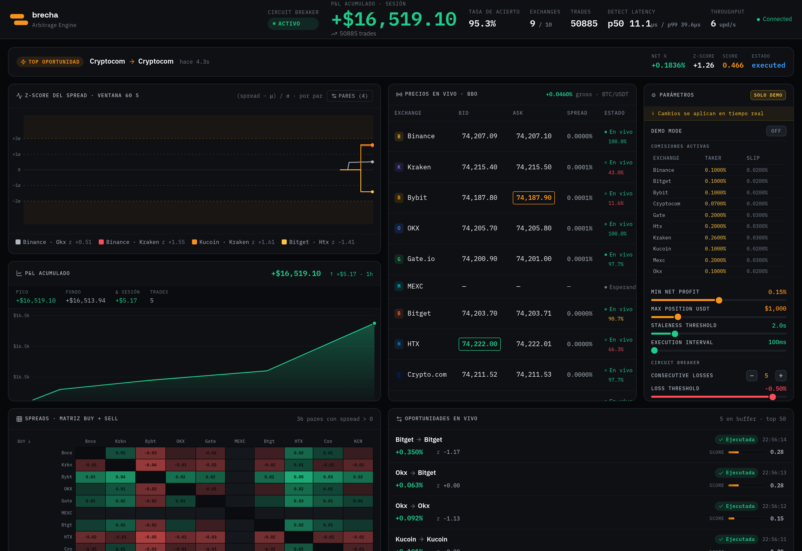

El dashboard se compone de tres tramos verticales:

1. **Header global** — StatusBar + TopOpportunityBanner.
2. **Cockpit** — grid 3×3 con SpreadChart, PriceTable, TweaksPanel, PnLChart, SpreadHeatmap, OpportunityFeed.
3. **Filas full-width** — PerPairPnL, StrategyPnL, TradeHistory.

A continuación cada panel en detalle.

---

## 1. StatusBar

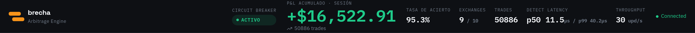

Barra superior. Siempre visible. Datos que carga desde el WS + un endpoint REST de uptime.

### Campos

| Campo | Significa | Estados / colores |
|-------|-----------|-------------------|
| **brecha · Arbitrage Engine** | Brand. | — |
| **Circuit Breaker** | Estado del risk manager. | `activo` (verde) → todo OK · `watching` (amber) → racha de pérdidas observada · `paused` (rojo) → ejecutor frenado por `CIRCUIT_BREAKER_PAUSE_MINUTES`. |
| **P&L acumulado · sesión** | Suma de `NetProfit` de todos los trades persistidos en la SQLite. | Verde si > 0, rojo si < 0, gris si = 0. |
| **{N} trades** | Conteo del historial total cargado del store. | — |
| **Tasa de acierto** | `wins / total` sobre el historial. | Verde > 80%, gris < 80%. |
| **Exchanges** | Cuántos exchanges tienen al menos un tick en este browser. `9/10` significa 9 activos. | — |
| **Trades** | Mismo conteo que P&L (duplicado para visibilidad). | — |
| **Detect Latency** | p50 y p99 en µs de cada `ProcessUpdate` del engine. Medido en el ring buffer de 1024 slots de `internal/engine`. Se publica cada 1 segundo. | — |
| **Throughput** | Updates/segundo procesados por el engine en el último segundo. | — |
| **Connected** | Estado del WebSocket del cliente. | Verde "Connected" cuando WS abierto · rojo "Reconnecting…" mientras backoff exponencial corre. |

### Interpretación

- **Circuit Breaker en `paused`**: el executor NO está dequeueando opps. Se reactiva solo después de `CIRCUIT_BREAKER_PAUSE_MINUTES`.
- **Throughput súbitamente bajo**: probablemente un exchange se desconectó. Mirá la columna "Estado" en PriceTable.
- **p99 latency creciendo**: heap creciendo descontrolado, posible bug de TTL.

---

## 2. Top Opportunity Banner

Se muestra debajo del StatusBar cuando hay una oportunidad activa de score alto (>0.5). Se auto-oculta después de 5s sin opps.

### Campos

- **TOP OPORTUNIDAD** + ruta `BuyEx → SellEx` + tiempo (`hace 416ms`).
- **NET %**: ganancia neta porcentual `(netProfit / buyAsk * 100)`.
- **Z-SCORE**: anomalía estadística vs distribución reciente. `+2.4` = 2.4σ por encima de la media.
- **SCORE**: combinación normalizada de netPct y z. Va de 0 a 1.
- **ESTADO**: `detected` · `executed` · `skipped` · `expired`.

### Cuándo aparece

- `Score > 0.5` (umbral hardcoded en `TopOpportunityBanner.tsx`).
- Hay al menos una opp en el store local.

---

## 3. Z-score del spread (SpreadChart)

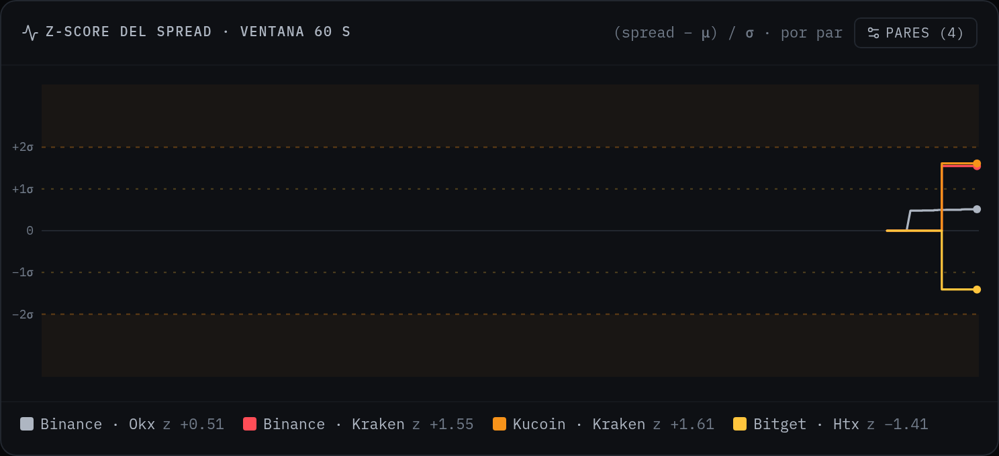

El panel estrella. Muestra el z-score `(spread_actual - μ_pair) / σ_pair` para los pares destacados en una ventana rodante de 60 segundos.

### Elementos

- **Líneas horizontales de referencia**:
  - `+2σ` y `-2σ` en naranja punteado (anomalías significativas).
  - `+1σ` y `-1σ` en amarillo tenue (anomalías moderadas).
  - `0` en gris (la media).
- **Bandas de fondo naranjas tenues**: zonas por encima de +2σ y debajo de -2σ. Visualmente marcan "hot zones".
- **Series de pares**: una línea por par destacado, con color estable (ver más abajo).
- **Dots en el extremo derecho**: valor actual de cada par.
- **Marcadores circulares con halo**: trades ejecutados sobre ese par durante la ventana. Verde si `NetProfit > 0`, rojo si < 0.

### Botones del header

- **Pares (N)**: abre el popover de selector. Muestra cuántos pares están destacados (default 4, máx 6).
- **Auto**: solo aparece cuando hay selección manual. Vuelve al modo auto-pick.

### Leyenda inferior

```
🔴 Binance · Bybit z -3.60   ⚪ Binance · Kraken z +1.62   🟢 Htx · Kraken z +1.12   🟠 Htx · Kucoin z +0.88
```

Por cada par:
- **Swatch** con el color asignado (estable mientras el par esté en featured).
- **Etiqueta** `ExA · ExB`.
- **Z actual** redondeado a 2 decimales. Si `|z| > 2`, se pinta naranja brillante (modo "hot").
- **`X/30`** pegado al final si el modelo de ese par aún no llegó a `MinSamples=30`.

Click en cualquier ítem de la leyenda oculta/muestra esa serie en el chart.

### Cómo interpretar valores típicos

| z-score | Lectura |
|---------|---------|
| `0.0 ± 0.5` | Spread dentro de lo esperado para ese par. No hay edge estadístico. |
| `±1.0 a ±2.0` | Anomalía moderada. Posible oportunidad si los costos lo permiten. |
| `> ±2.0` | Anomalía fuerte. El sistema rankea esto cerca del top del heap. |
| `> ±3.0` | Outlier extremo. A menudo es ruido de warmup o un mercado dislocado. |

### Cómo se eligen los pares destacados

Modo auto (default):
- `pickFeaturedPairs(stats, prev, n=4)` con histeresis. Mantiene los pares previos que aún califican (`Samples ≥ 30`, `Std > 0`) y solo llena los slots vacíos con el siguiente top por `Std`. Esto evita el flickering de pares entrando/saliendo del top-4 cuando Welford nudge la variancia.

Modo manual:
- El usuario abre el picker y selecciona hasta 6 pares. Click en "Auto" vuelve al modo automático.

### Asignación de colores

La paleta tiene 6 colores. El algoritmo:

1. Para cada par en `featuredPairs`, ordenado alfabéticamente, calcula el slot preferido = `hash(pair) % 6`.
2. Si el slot está libre, se lo asigna. Si está ocupado, busca el siguiente libre.
3. Mientras `|featuredPairs| ≤ 6`, garantiza no-colisión.

El par mantiene el mismo color mientras el set destacado no cambie su composición. Si entra un par nuevo, los existentes pueden rotar para acomodar.

---

## 4. Selector de pares (popover)

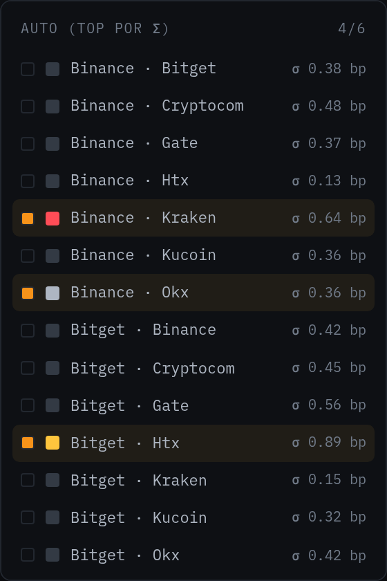

Se abre al hacer click en "Pares (N)". Renderiza en un portal a `document.body` para no quedar atrapado por overflow del chart card.

### Estructura

- **Header**: indicador de modo (`Auto (top por σ)` o `Selección manual`) + contador `{N}/{MAX_FEATURED}`.
- **Lista**: todos los pares con `Std > 0` ordenados **alfabéticamente** (no por Std, así no se reordena cada tick).
- **Cada fila**: checkbox + swatch + nombre del par + `σ X.XX bp` (volatilidad en basis points).

### Estados de fila

| Estado | Aspecto |
|--------|---------|
| Seleccionado | Checkbox lleno (cuadrito naranja), swatch coloreado con el color asignado en featured, fondo naranja tenue. |
| Disponible | Checkbox vacío, swatch gris neutro (no preview del color que tendría — evita confusión por colisión hash). |
| Cap alcanzado | Opacidad 0.4, cursor `not-allowed`. No se puede agregar más sin sacar otro. |

### Interacción

- Click en fila no seleccionada → agrega al featured (si hay slot libre).
- Click en fila seleccionada → la saca.
- Click afuera del popover o en el botón "Pares" otra vez → cierra.
- Botón "Auto" en el header del chart → resetea a auto-pick.

---

## 5. Precios en vivo (PriceTable)

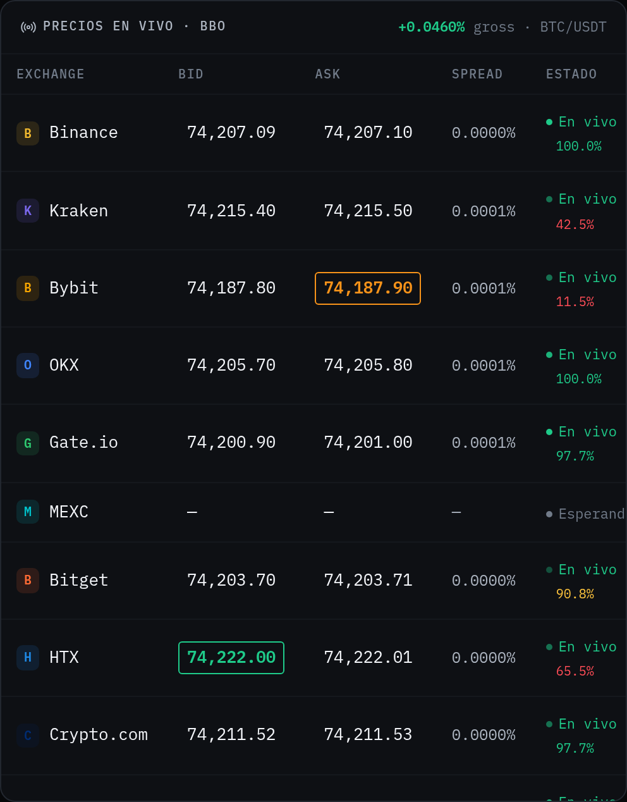

BBO (Best Bid / Best Offer) por exchange. Esta tabla es la "fuente de verdad" del estado del mercado tal como lo ve el bot.

### Columnas

| Columna | Contenido |
|---------|-----------|
| **Exchange** | Logo + nombre. |
| **Bid** | Best bid (precio al que el exchange compra BTC). |
| **Ask** | Best ask (precio al que el exchange vende BTC). |
| **Spread** | `(ask - bid) / ask` en porcentaje. |
| **Estado** | Indicador de freshness + uptime de sesión. |

### Highlights del header del panel

- **`+0.0204% gross · BTC/USDT`** en la esquina superior derecha: el mejor delta cross-exchange en este momento, ANTES de fees. Muestra el techo teórico de arbitraje en este instante.

### Highlights de celdas

| Highlight | Significa |
|-----------|-----------|
| **Borde naranja sobre Ask** | Este es el ask más bajo en este momento. Es el mejor lugar para comprar BTC. |
| **Borde verde sobre Bid** | Este es el bid más alto. Es el mejor lugar para vender. |
| **Flash de fondo** (un instante) | El precio acaba de cambiar. |

### Estado por exchange

| Indicador | Color | Significa |
|-----------|-------|-----------|
| `● En vivo 100.0%` | Verde | Última actualización < 10s. Uptime de sesión ≥ 95%. |
| `● En vivo 65.3%` | Amber | Recibido recientemente pero el uptime de la sesión está caído. |
| `● Esperando…` | Gris | Connector conectado pero sin tick aún (típico en los primeros segundos). |
| `● Stale` | Rojo | Última actualización > 10s. El exchange se considera caído. |

### Interpretación de columnas

- **Bid > Ask** (raro): error de feed o lag de un lado. El detector filtra estos casos.
- **Spread 0.0000%**: bid y ask son virtualmente iguales (mercado muy ajustado). El exchange tiene libro muy líquido.
- **MEXC mostrando "—"**: MEXC bloquea sub no autenticada al canal de BBO en algunas regiones. El connector loggea `Not Subscribed successfully` y el panel queda sin precio. No es un bug del bot.

---

## 6. Parámetros (TweaksPanel)

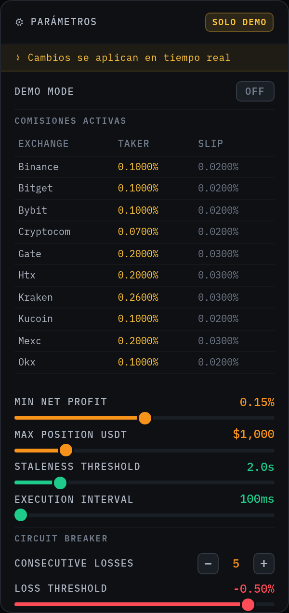

Editor en vivo. Cada cambio hace un `PATCH /api/config` y se aplica al siguiente tick. **NO requiere reiniciar el server.**

Badge **"SOLO DEMO"** en el header indica que el panel está habilitado solo cuando `DEMO_MODE=true`. En producción está disabled visualmente.

### Secciones (top a bottom)

#### Demo Mode toggle

| Estado | Efecto |
|--------|--------|
| `OFF` (default) | Fees retail reales por exchange. Threshold y position cap se respetan. |
| `ON` | Pinta el dashboard con badge "SOLO DEMO" y permite editar las fees abajo. |

#### Comisiones activas (tabla por exchange)

Cada fila: `Exchange | Taker % | Slip %`.

- **Taker**: comisión por leg agresivo. La fee real cambia por venue (ver `docs/exchanges.md` para los valores).
- **Slip**: fracción de slippage adicional sobre el buy ask, modelando la diferencia entre precio publicado y precio ejecutado.

Click en una celda para editar. El cambio se aplica al siguiente `Detect`.

#### Sliders

| Slider | Rango | Significa |
|--------|-------|-----------|
| **MIN NET PROFIT** | 0% – 0.5% | Threshold mínimo para que un opp entre al heap. Más alto = más selectivo. |
| **MAX POSITION USDT** | 100 – 5000 | Cap por trade. Kelly puede reducirlo aún más cuando hay suficientes muestras. |
| **STALENESS THRESHOLD** | 0.5s – 5s | Counterparties con `now - ReceivedAt` mayor son descartados del Detect. |
| **EXECUTION INTERVAL** | 50ms – 500ms | Cada cuánto el executor saca el top del heap. |

#### Circuit Breaker

| Control | Significa |
|---------|-----------|
| **CONSECUTIVE LOSSES** | Cuántos trades consecutivos con loss disparan la pausa. |
| **LOSS THRESHOLD** | Net loss máximo tolerado en esa racha. Si la suma cae por debajo, pausa. |

Cambios se aplican vía `PATCH /api/config` con body `{ min_net_profit_pct, max_position_usdt, staleness_threshold_ms, execution_interval_ms, fees, circuit_breaker_n, circuit_breaker_loss_pct }`. La respuesta es el nuevo estado de la config.

### Cómo experimentar

- **Subir MIN NET PROFIT a 0.3%**: el heap deja de aceptar opps marginales. Vas a ver el `bx-feed` casi vacío pero las pocas opps que ejecutan tendrán P&L más jugoso por trade.
- **Bajar STALENESS THRESHOLD a 0.5s**: counterparties que dependen de exchanges con jitter quedan fuera. Verás menos opps con OKX/MEXC.
- **Disparar circuit breaker**: editá fees a algo extremo (ej. taker 1% en todos) para forzar netProfit negativos en cadena, en 5 trades el CB pausa.

---

## 7. P&L acumulado (PnLChart)

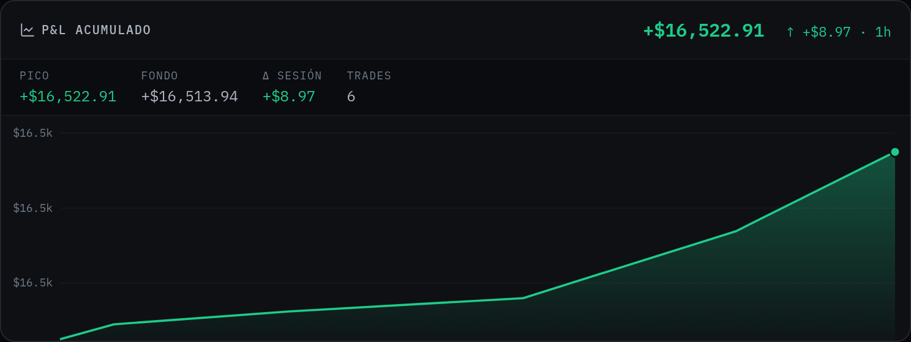

Serie temporal del net profit acumulado desde el primer trade de la sesión.

### Header

- **P&L ACUMULADO** (label).
- **+$X,XXX.XX** (valor actual). Verde si > 0, rojo si < 0.
- **↑ +$Y · 1h**: delta de la última hora. Verde si arriba, rojo si abajo.

### Stats row (debajo del header)

| Stat | Significa |
|------|-----------|
| **Pico** | Valor máximo histórico de la sesión. |
| **Fondo** | Valor mínimo. Si fondo > 0, no hubo drawdown. |
| **Δ sesión** | `last - first` (cambio total desde que empezó la sesión). |
| **Trades** | Cantidad de puntos en la serie. |

### Chart

- **Eje Y**: rango dinámico ajustado al `[min - 10%, max + 10%]` de los datos. NO fuerza 0. Esto evita el "rectángulo plano" cuando P&L crece monotónicamente lejos del cero.
- **Eje X**: timestamps en formato `HH:MM`. Tres ticks: start, mid, end.
- **Línea de referencia 0**: dashed gris. Solo aparece si el rango Y cruza 0.
- **Área**: gradiente debajo de la línea (verde si positivo, rojo si negativo), va al baseline del plot (no a y=0).
- **Marcadores "pico" y "fondo"**: dots etiquetados cuando hay extremos relevantes.
- **Dot del último valor**: ronde sólido al final de la serie.

### Tooltip

Hover muestra:
- Valor exacto del trade en ese punto.
- Timestamp con segundos.
- Línea vertical guía.

### Interpretación

- **Curva monótona ascendente**: las strategies están convergiendo. Win rate alto.
- **Drawdown visible (dip seguido de recuperación)**: circuit breaker probablemente no se disparó (loss en absoluto bajo la trigger), o algunos trades quedaron negativos por slippage.
- **Línea plana**: executor pausado o sin opps que pasen el threshold.

---

## 8. Spread Heatmap

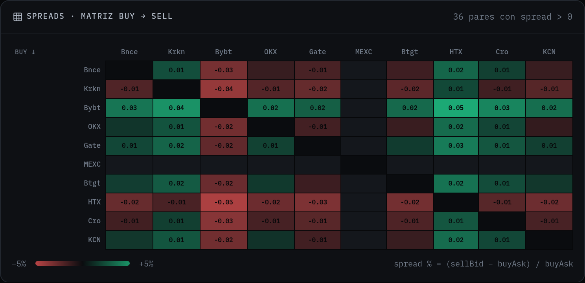

Matriz 10×10 con los spreads cross-exchange en tiempo real.

### Estructura

- Filas: exchange de **compra** (buy).
- Columnas: exchange de **venta** (sell).
- Celda `(buy, sell)`: `(sell.bid - buy.ask) / buy.ask` en %.

### Colores

| Magnitud | Color |
|----------|-------|
| `> 0.05%` | Verde brillante (oportunidad clara). |
| `0.01% a 0.05%` | Verde tenue. |
| `≈ 0%` | Negro / sin color (no arbitrable). |
| `< -0.05%` | Rojo brillante (gap inverso, no operable directo). |
| `-0.05% a -0.01%` | Rojo tenue. |

Diagonal (buy = sell) está siempre vacía / oscura.

### Flash de trade

Cuando ejecuta un trade, la celda `(buy, sell)` correspondiente hace **flash verde** (`NetProfit > 0`) o **flash rojo** (`NetProfit < 0`) durante ~600ms. Es la visualización más directa de qué par está produciendo P&L.

### Footer

`{N} pares con spread > 0` indica cuántas celdas están actualmente en verde (oportunidad teórica antes de fees).

### Interpretación

- **Cuadrante verde concentrado**: un exchange es sistemáticamente caro/barato (ej. HTX históricamente paga más por BTC, así que filas que terminan en HTX suelen verdes).
- **Filas/columnas vacías**: ese exchange está caído o sin datos frescos.
- **Diagonal con sombra verde sutil**: spread bid-ask interno (no arbitraje, pero indica liquidez).

---

## 9. Oportunidades en vivo (OpportunityFeed)

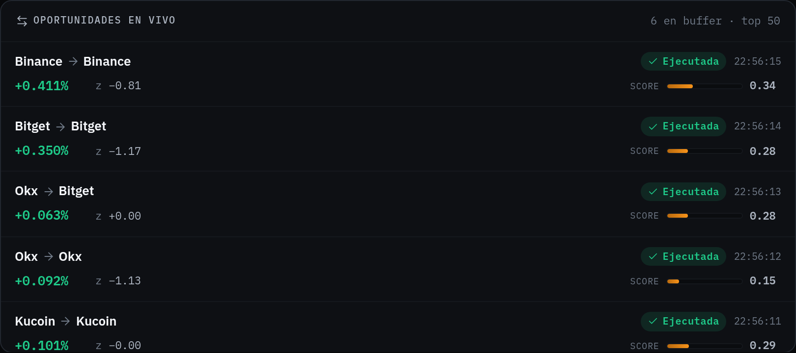

Stream de las últimas opportunities (executed y skipped) que llegaron por WebSocket en esta sesión.

### Estructura de cada fila

```
[BuyEx → SellEx]   [status badge]                  [hora]
+0.063%   z +0.00                  score [▓▓▓▓░░] 0.28
```

- **Ruta**: `BuyEx → SellEx`. Para triangular, ambos son el mismo exchange (`Binance → Binance`) porque el ciclo es intra-exchange.
- **Status badge**:
  - 🟢 `✓ Ejecutada` — pasó risk + executor lo procesó OK.
  - 🟠 `Skipped` — risk manager la descartó (typically circuit breaker o duplicate).
  - 🔴 `Expired` — TTL del heap excedido antes de dequeue.
  - ⚪ `Detected` — raro de ver porque el WS solo emite executed/skipped.
- **Hora**: HH:MM:SS del momento de ejecución.

### Segunda línea

- **NET %**: ganancia neta % del opp. Verde si positivo, rojo si negativo.
- **z X.XX**: z-score del opp en el momento de detección. Si `|z| > 2`, se pinta naranja brillante (hot).
- **score**: barra de progreso + valor numérico.
  - Barra naranja del 0% al 100% (score × 100).
  - Si `score ≥ 0.5`: glow naranja brillante.
- **Score 0.50+**: el opp ganó el heap por su anomalía y/o netPct alto.

### Header del panel

`{N} en buffer · top 50` indica cuántas opps hay en memoria del browser. Se mantienen solo las últimas 50 para no agotar memoria.

### Por qué muchos opps son `Binance → Binance` u `Okx → Okx`

Esos son los de strategy **triangular**, que opera intra-exchange (ciclo USDT→BTC→ETH→USDT en el mismo venue). No es bug.

---

## 10. Trade History

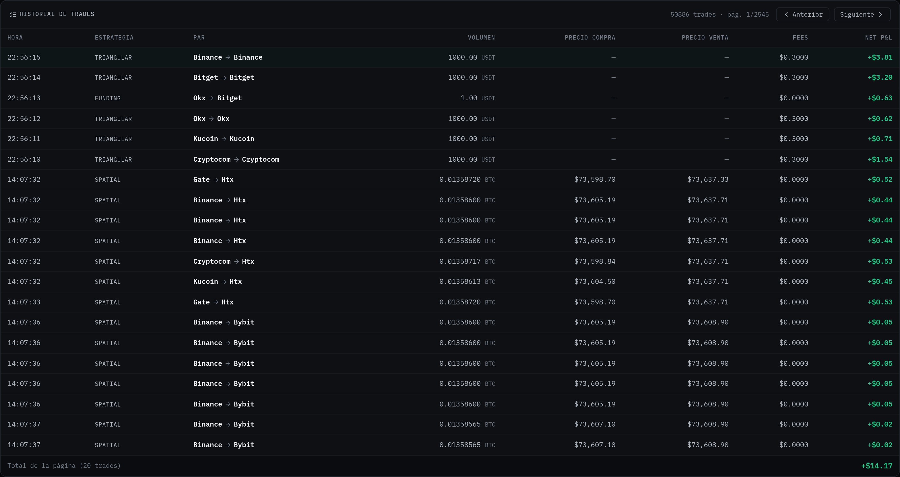

Tabla paginada de todos los trades ejecutados, persistidos en SQLite.

### Columnas

| Columna | Contenido |
|---------|-----------|
| **Hora** | Timestamp de ejecución. |
| **Estrategia** | `spatial` · `triangular` · `funding`. |
| **Par** | `BuyEx → SellEx`. |
| **Volumen** | Cantidad. Unidad: `BTC` si strategy=spatial, `USDT` para las otras (porque triangular es notional del ciclo, funding es notional del perp). |
| **Precio compra** | VWAP del buy leg. `—` si la strategy no aplica (triangular/funding). |
| **Precio venta** | VWAP del sell leg. `—` si la strategy no aplica. |
| **Fees** | Fees totales del trade en USDT. |
| **Net P&L** | NetProfit en USDT. Verde si > 0, rojo si < 0. |

### Footer de página

`Total de la página ({N} trades)` con la suma del net P&L de la página visible.

### Paginación

20 trades por página. Header derecho muestra `{total} trades · pág X/Y` con botones `Anterior` / `Siguiente`. Click en una fila no hace nada (no hay drill-down todavía).

### Badge "parcial"

Si `Volume < RequestedVolume` (el sell leg no pudo matchear todo lo comprado), aparece un badge naranja `parcial` al lado del volumen.

---

## 11. P&L por par (PerPairPnL)

Barra horizontal ordenada por P&L acumulado por exchange pair.

### Estructura

- Top 8 pairs de la sesión.
- Cada fila: `BuyEx → SellEx` + barra horizontal con largo proporcional al P&L + valor en USDT + cantidad de trades + % win rate.

### Interpretación

- Identifica qué rutas son más rentables actualmente.
- Si todos los positivos terminan en un mismo exchange, es señal de que ese venue tiene un sesgo de precio (caro/barato sistemáticamente).

---

## 12. Backtest

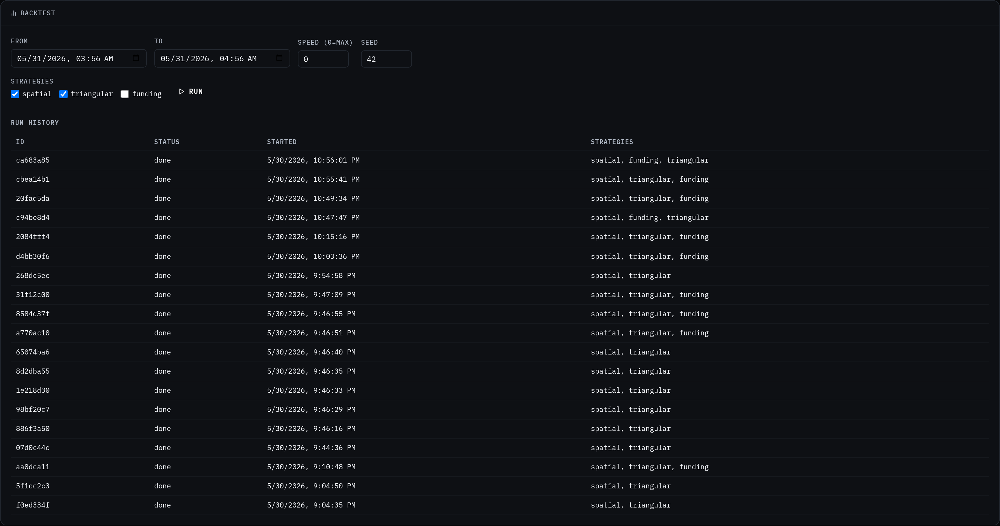

Panel al final del dashboard. Permite lanzar replays determinísticos sobre los frames grabados por el recorder WAL y ver métricas cuantitativas por strategy.

### Controles (top row)

| Campo | Significa |
|-------|-----------|
| **From** | Inicio del rango temporal a replayear (datetime-local). |
| **To** | Fin del rango. |
| **Speed (0=max)** | `0` = sin sleep entre frames (réplica instantánea). `1.0` = realtime. `2.0` = 2× realtime. |
| **Seed** | PRNG seed para reproducibilidad. Mismo seed + mismo rango = mismo resultado. |
| **Strategies** | Checkboxes: `spatial` · `triangular` · `funding`. |
| **Run** | Botón naranja. POST a `/api/backtest/start`. |

### Progress bar

Aparece durante el run. Poll cada 500ms a `/api/backtest/status`. Muestra `state` (`running` / `done`) + `progress` (0-100%).

### Results — RUN {short_id}

Aparece cuando el run termina. Tabla por strategy:

| Columna | Significa |
|---------|-----------|
| **Strategy** | `spatial` / `funding` / `triangular`. |
| **Total PnL** | Net profit acumulado del replay. |
| **Sharpe** | Retorno ajustado por volatilidad. >2 es bueno, >3 excelente. En demo se infla mucho porque executor solo emite trades positivos. |
| **Max DD** | Pico-a-valle máximo en USDT. |
| **Hit Rate** | Fracción de trades positivos. |
| **Trades** | Cantidad total ejecutada en el replay. |

### Run History

Tabla con todos los runs persistidos. Click en una fila carga sus métricas en la Results table de arriba (sin volver a correr).

| Columna | Contenido |
|---------|-----------|
| **ID** | 8 primeros chars del UUID. |
| **Status** | `done` cuando terminó, `running` mientras corre, `failed` si hubo error. |
| **Started** | Timestamp de cuando empezó el run. |
| **Strategies** | Comma-separated list de strategies seleccionadas. |

### Recording

El recorder arranca **on por default** desde el server. Cada `PriceUpdate` que entra al agregador se persiste a la WAL SQLite. Para apagarlo (no recomendado): `POST /api/backtest/recording` con `{"enabled": false}`.

Ver `docs/backtest.md` para el ciclo completo de uso, las métricas en detalle y casos prácticos (A/B testing de parámetros, sweep de thresholds, etc.).

---

## 13. P&L por strategy (StrategyPnL)

Similar a PerPairPnL pero agrupado por strategy (`spatial`, `funding`, `triangular`).

### Columnas mostradas

- **Strategy** (label).
- **Barra horizontal** + **Total P&L USDT** + **Trade count** + **Win rate %**.

### Por qué los win rates suelen ser 100%

Los executors son determinísticos en demo y solo emiten cuando `NetProfit > 0` por construcción. El interés del win rate aparece cuando metés slippage agresivo, L2 más estrecho, o ejecutás contra mercado real donde fallar es probable.

### Backwards compat: trades sin strategy

Los trades persistidos antes de que se metiera el campo `Strategy` tenían el campo vacío. El backend ahora los **filtra** del endpoint `/api/pnl-by-strategy` para no mostrar un bucket confuso "unknown". Solo strategies con tag explícito aparecen.

---

## Mapa de eventos WebSocket → paneles

Cada evento del WS actualiza paneles específicos del store de Zustand. Mapa de propagación:

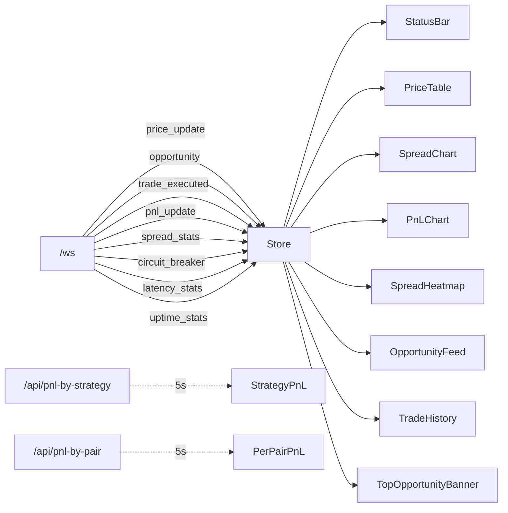

Los paneles **PerPairPnL** y **StrategyPnL** no están en el WS — hacen poll cada 5s a sus endpoints REST. El resto es push-driven.
