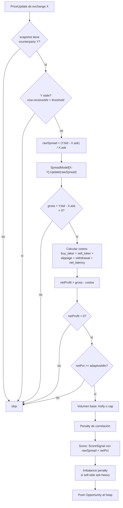
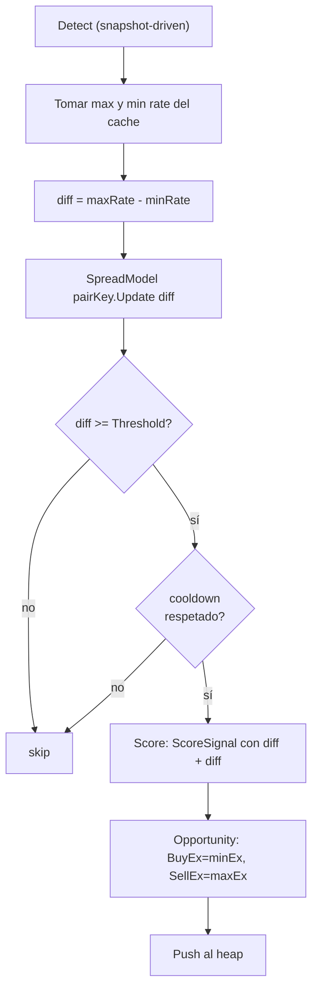
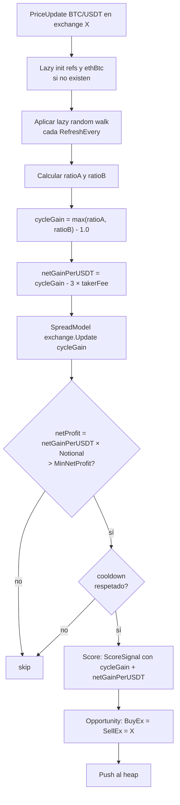
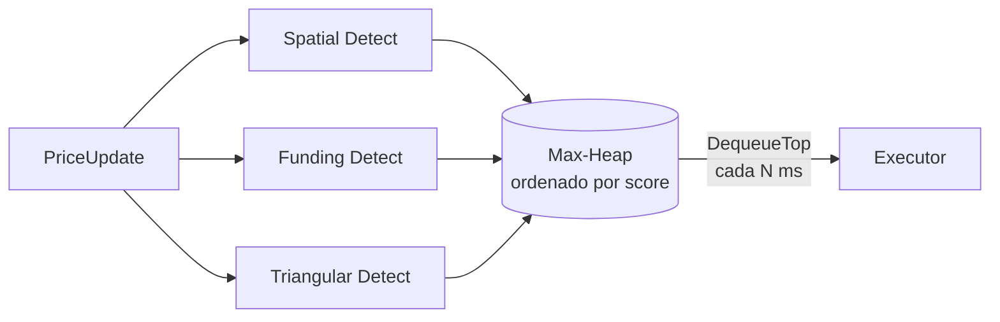

# Estrategias

Brecha corre tres estrategias en paralelo, todas implementando la misma interfaz `Strategy`:

```go
type Strategy interface {
    Name() string
    Detect(update PriceUpdate, snapshot map[string]PriceUpdate, now time.Time) []Opportunity
}
```

El engine fan-outea cada `PriceUpdate` a las tres, todas pueden emitir opps al mismo max-heap global, todas compiten por slots de ejecución.

## Resumen comparativo

| Strategy | Tipo de arb | Activo subyacente | Cross-exchange? | Usa z-score? |
|----------|-------------|-------------------|-----------------|--------------|
| **spatial** | Diferencia de precio BTC entre exchanges | BTC spot | Sí (buy en X, sell en Y) | Sí (sobre raw spread) |
| **funding** | Diferencial de funding rate entre perp futures | BTC perpetual | A veces | Sí (sobre rate diff) |
| **triangular** | Ciclo cerrado intra-exchange | BTC + ETH (legs) | No | Sí (sobre cycleGain) |

## 1. Spatial

Estrategia central del bot. Operación: comprar BTC en el exchange con el ask más bajo, venderlo en el exchange con el bid más alto.

### Flujo de detección



### Modelo de costos (las 4 categorías del reto)

```
gross         = sellBid − buyAsk
buy_taker     = buyAsk  × takerFee[buyEx]
sell_taker    = sellBid × takerFee[sellEx]
slippage_buy  = buyAsk  × slippageFactor[buyEx]
withdrawal    = buyAsk  × withdrawalBTC[buyEx]
net_latency   = buyAsk  × netLatencyBps[buyEx]/1e4
              + sellBid × netLatencyBps[sellEx]/1e4 × ageFactor

ageFactor     = 1 + sellAgeMs/1000  (capeado a 3)

net_profit    = gross − buy_taker − sell_taker − slippage_buy
              − withdrawal − net_latency
```

`ageFactor` penaliza counterparties stale: el bid del sell-side puede haber driftado durante el round-trip WS. A más viejo el dato, más slippage probable.

### Adaptive threshold

En vez de un threshold fijo `MIN_NET_PROFIT_PCT`:

```
adaptiveMin = SPATIAL_BASE_MIN_NET_PROFIT_PCT + SPATIAL_ADAPTIVE_COEFF × spreadStd
```

Cuando el par está volátil (std alta), el sistema exige más margen para considerar arbitrable. En mercados quiet, baja el umbral.

### Kelly sizing

Una vez detectada la opp, el volumen sale de:

```go
fraction := kellyEstimator[pair].Fraction()   // 0..KellyMaxFraction
volume   := fraction * MaxPositionUSDT / buyAsk
```

`KellyEstimator` mantiene mean y variancia (Welford) de los **net returns realizados** de cada par. Cuando hay `>= KellyMinSamples` (default 10), devuelve la fracción Kelly clásica `f* = μ/σ²` capeada a `KellyMaxFraction` (default 0.25, conservador).

Cuando el estimador no tiene aún suficientes muestras, devuelve `1.0` (usa el cap plano).

### Correlation penalty

Ring buffer de los últimos `CORR_WINDOW_N` (default 50) trades. Si la opp comparte buy o sell con muchos trades recientes:

```
matches := ring.CountSameExchange(buyEx, sellEx)
penalty := 1.0 - CORR_PENALTY_WEIGHT * matches / CORR_WINDOW_N
penalty := max(0.1, penalty)
volume  := volume * penalty
```

Evita concentración: si todos los últimos trades fueron en Binance, la próxima opp en Binance sale más chica.

### Imbalance penalty (sell-side L2)

Si el sell-side tiene un book ask-heavy (mucho ask, poco bid), es probable que el precio caiga mientras intentamos vender:

```go
imbalance := (sellBidSize - sellAskSize) / (sellBidSize + sellAskSize)
if imbalance < 0 {
    score -= ImbalancePenaltyWeight * (-imbalance)
}
```

`ImbalancePenaltyWeight` default 0.15.

### Ejecución

`internal/executor/executor.go`. Camina el L2 book:

```
buyFilled, vwapBuy, buyPartial   := walk(askLevels,  targetVolume)
sellFilled, vwapSell, sellPartial := walk(bidLevels, buyFilled)
```

Si `sellFilled < buyFilled`, **reversa atómica**: debita el BTC recién acreditado y devuelve el USDT acumulado al VWAP del buy (no BBO × volume — ese bug filtraría unos cents por trade fallido).

`Trade.PartialFill = true` cuando `Volume < RequestedVolume`.

### Spread model

Welford one-pass sobre ring buffer de 500 muestras. Se entrena con el **raw spread** (incluyendo negativos cuando no hay arb), no con netPct. Por qué:

- El modelo debe reflejar la distribución real de spreads del par.
- Si lo entrenás solo con netPct, queda sesgado hacia positivos (solo ves los detectables).
- Para que `z = (rawSpread - μ) / σ` tenga sentido, los datos de entrenamiento y consulta deben venir de la misma distribución.

`MinSamples = 30` para considerar el modelo "ready". Hasta ahí, `z = 0` y `score = normNetPct`.

---

## 2. Funding

Arbitraje de funding rate sobre el perpetual de BTC. La idea: en exchanges donde el funding es alto positivo, los longs pagan a los shorts; en exchanges con funding bajo o negativo, lo contrario. Si la diferencia entre dos venues es lo suficientemente grande, se puede shortear el caro + longear el barato y capturar el diferencial sin exposición direccional.

### Modelo simplificado (demo)

El proyecto modela synthetic funding rates por exchange con un wave generator + jitter (`internal/strategy/funding/funding.go:tick`). Cada `PollInterval`, todos los exchanges reciben un nuevo rate:

```
rate[exchange] = sin(ticks/3 + i) * BaseDifferential + jitter
```

donde `i` es el índice del exchange para que las fases no coincidan.

### Flujo de detección



### Notas

- **BuyExchange = minEx**: la pierna larga va en el venue con funding más bajo.
- **SellExchange = maxEx**: la pierna corta va en el venue con funding más alto.
- **No tiene BuyPrice / SellPrice**: porque el opp es sobre rates, no sobre precios spot. En el dashboard aparece `—` en esas columnas.
- **NetProfit = diff × Notional** (donde Notional default 1000 USDT).
- **Volume = 1.0** placeholder; el sizing real vive en `FundingStrategy.Notional`.

### Spread model

Per-par (`minEx->maxEx`). Entrenado con cada `diff` por tick (incluso si está debajo del threshold). Cuando el modelo está ready y un opp dispara, el z indica qué tan anómalo es el diferencial actual vs la distribución reciente.

### Cooldown

`EmitCooldown` (default 5s) por par. Evita spam si el diff queda alto durante varios ticks.

---

## 3. Triangular

Ciclo cerrado intra-exchange: USDT → BTC → ETH → USDT. Usa tres precios independientes:

- **BTC/USDT** del feed real del exchange.
- **ETH/USDT** del `refs[exchange]` (seedeado con `SeedRefPrice` + noise determinístico).
- **BTC/ETH** del `ethBtc[exchange]` (market cross rate, independiente del implied).

Sin un BTC/ETH "de mercado" independiente, el ciclo colapsa al bid-ask spread del BTC (que no es triangular arb). Modelar el cross independiente es lo que hace que la matemática del ciclo tenga sentido.

### Las dos direcciones del ciclo

```
Cycle A:  1 USDT → 1/ask BTC → (1/ask)/ethBtcMarket ETH → (1/ask) × ethRef/ethBtcMarket USDT
ratioA  = ethRef / (ask × ethBtcMarket)

Cycle B:  1 USDT → 1/ethRef ETH → (ethBtcMarket/ethRef) BTC → (ethBtcMarket × bid)/ethRef USDT
ratioB  = (ethBtcMarket × bid) / ethRef

cycleGain = max(ratioA, ratioB) - 1.0
```

### Flujo



### Notas

- **BuyExchange = SellExchange = X**: el ciclo es intra-exchange. Ambos campos del opp llevan el mismo exchange.
- **No tiene BuyPrice / SellPrice**: hay 3 precios distintos por trade, ninguno único. El dashboard muestra `—`.
- **3 × takerFee**: cada leg paga taker fee, así que el costo total es `3 × takerFee × Notional`.
- **Volume = Notional** (default 1000 USDT, NO 1000 BTC). El dashboard muestra unidad correcta por strategy.

### Por qué ETH

El reto pide "arbitraje BTC". La strategy triangular incluye ETH como leg intermedio. El activo principal sigue siendo BTC (es el centro del ciclo y donde reside el inventario momentáneo), pero técnicamente el ciclo cruza por ETH.

Está activada por default porque demuestra que la infra soporta multi-strategy. Si querés una corrida estrictamente BTC-only, podés desactivarla con `TRIANGULAR_ENABLED=false`.

---

## Cómo compiten en el heap

Las tres strategies pueden emitir opps por el mismo `PriceUpdate`. Todas van al **mismo max-heap** global, ordenado por `Opportunity.Score`:



El executor saca **uno solo** por tick de ejecución (`EXECUTION_INTERVAL_MS`). Si en un tick spatial emite con score 0.55, triangular con 0.40 y funding con 0.30 — ejecuta spatial. Las otras quedan en el heap; si su TTL expira (`OPPORTUNITY_TTL_MS`), se descartan.

Implicancia: la fórmula de score (`ScoreSignal`) está deliberadamente normalizada a [0, 1] para que las tres strategies compitan en la misma escala. Sin la normalización, una strategy con netPct chico (spatial) sería siempre dominada por strategies con cycleGain alto (triangular).

Ver `docs/scoring.md` para el detalle de la fórmula.
