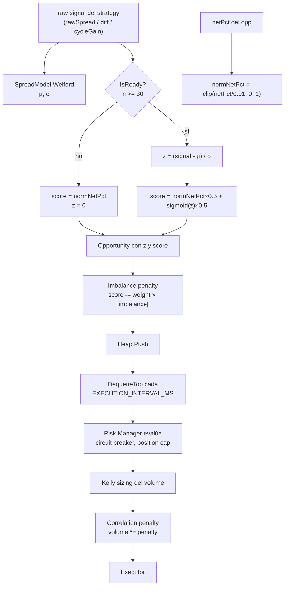

# Scoring y métricas

Este documento cubre la matemática detrás del rankeo de oportunidades. Si querés saber por qué un opp con netPct chico le gana a uno con netPct grande, leé `## Score formula` debajo.

## SpreadModel — Welford rolling estimator

Cada strategy mantiene uno o más `SpreadModel` (`internal/model/spread.go`). Cada modelo estima `μ` (mean) y `σ` (std dev) de una señal específica usando Welford one-pass over a ring buffer de las últimas 500 muestras.

### Algoritmo Welford

Para cada nueva muestra `x`:

```
n         ← n + 1
delta     ← x - μ
μ         ← μ + delta / n
delta2    ← x - μ
M2        ← M2 + delta × delta2
variance  ← M2 / n
σ         ← √variance
```

Ventajas vs batch:
- O(1) por update (no re-suma 500 valores).
- Numéricamente estable (no acumula errores de punto flotante como `Σx² / n - (Σx/n)²`).

### Eviction (reverse-Welford)

Cuando el ring buffer está lleno (`n == 500`), el sample más viejo `x_old` se evicciona:

```
oldMu  ← (n × μ - x_old) / (n - 1)
M2     ← M2 - (x_old - μ) × (x_old - oldMu)
μ      ← oldMu
n      ← n - 1
```

Es la inversa exacta del Welford forward. Permite mantener una **ventana deslizante** sin recalcular desde cero.

### `IsReady`

```go
func (m *SpreadModel) IsReady() bool {
    return m.n >= MinSamples   // MinSamples = 30
}
```

Hasta que el modelo no tiene 30 muestras, `ScoreSignal` devuelve `z = 0` y `score = normNetPct` (fallback). Esto evita publicar z-scores ruidosos cuando aún no hay suficiente data.

### Señal de entrenamiento por strategy

| Strategy | Señal entrenada en `SpreadModel` |
|----------|----------------------------------|
| `spatial` | `rawSpread = (sellBid - buyAsk) / buyAsk` (incluye negativos) |
| `funding` | `diff = maxRate - minRate` (siempre ≥ 0) |
| `triangular` | `cycleGain = max(ratioA, ratioB) - 1.0` (puede ser negativo) |

Cada strategy entrena con su señal "natural" para que la distribución refleje el régimen normal del par.

---

## Score formula

Helper compartido en `internal/model/spread.go`:

```go
const NetPctScale = 0.01

func ScoreSignal(sm *SpreadModel, rawSignal, netPct float64) (float64, float64) {
    normNetPct := clip(netPct / NetPctScale, 0, 1)

    if sm == nil || !sm.IsReady() {
        return 0, normNetPct  // fallback
    }

    z := sm.ZScore(rawSignal)
    score := normNetPct*0.5 + sigmoid(z)*0.5
    return z, score
}

func sigmoid(x float64) float64 {
    return 1.0 / (1.0 + math.Exp(-x))
}
```

### Por qué normNetPct, no netPct crudo

`netPct` típico es del orden de `0.0005` (5 basis points). Sin normalizar, el término `netPct × 0.6` daría `0.0003`, mientras `sigmoid(z) × 0.4` daría `~0.2`. La mezcla 60/40 sería ficción: sigmoid domina por 3 órdenes de magnitud.

Normalizando `netPct` con `clip(netPct/0.01, 0, 1)`:

| netPct | normNetPct |
|--------|------------|
| 0.0005 (5 bps) | 0.05 |
| 0.0015 (15 bps) | 0.15 |
| 0.005 (50 bps) | 0.50 |
| 0.01 (1%) | 1.0 (saturado) |
| 0.02 (2%) | 1.0 (saturado) |

Ahora ambos términos viven en `[0, 1]` y la mezcla 50/50 es real. Un opp con `netPct=0.5%` y `z=2σ`:

```
normNetPct = 0.5
sigmoid(2) ≈ 0.881
score      = 0.5 × 0.5 + 0.881 × 0.5 = 0.69
```

### Por qué sigmoid del z

El z-score puede ser cualquier real (en teoría). Sin compresión, un z extremo (ej. 28σ por warmup) dominaría completamente. `sigmoid` lo comprime a `(0, 1)`:

| z | sigmoid(z) |
|---|------------|
| -3 | 0.047 |
| -2 | 0.119 |
| -1 | 0.269 |
| 0 | 0.500 |
| +1 | 0.731 |
| +2 | 0.881 |
| +3 | 0.953 |

`sigmoid(0) = 0.5` → un opp en la media de la distribución contribuye 0.25 al score. Si además tiene `normNetPct = 0.5`, el score final es 0.5 (medio del rango).

### Fallback cuando el modelo no está listo

Si el `SpreadModel` no tiene 30 muestras:

```
z     = 0
score = normNetPct
```

El opp todavía compite en el heap (con un score chico), pero sin contribución estadística. Cuando los modelos calientan (~30 segundos), el sigmoid empieza a aportar y los scores suben.

---

## Z-score interpretación práctica

En el dashboard, el z-score aparece en:
- **SpreadChart**: serie temporal por par destacado.
- **OpportunityFeed**: badge "z X.XX" en cada fila.
- **TopOpportunityBanner**: número grande.

Lectura rápida:

| z | Probabilidad bajo normalidad | Interpretación |
|---|------------------------------|----------------|
| 0.0 | 50% de lo observado | Spread "promedio". Sin edge estadístico. |
| ±1.0 | ~32% de las muestras | Anomalía mild. |
| ±2.0 | ~5% | Anomalía notable. Threshold visual del UI (badge naranja "hot"). |
| ±3.0 | ~0.3% | Outlier extremo. A menudo ruido de warmup. |

Caveat: las distribuciones de spread cross-exchange **no son perfectamente normales**. Tienen colas pesadas. Un z=3 es menos raro de lo que la normal sugeriría. Pero como herramienta de **ranking relativo** entre opps, sirve.

---

## Kelly sizing

`internal/sizing/kelly.go`. Per-par. Estima la fracción óptima del bankroll a apostar.

### Fórmula clásica Kelly

```
f* = μ / σ²
```

donde `μ` y `σ²` son la media y variancia de los net returns realizados del par.

### Implementación

`KellyEstimator` mantiene `μ` y `M2` (Welford state) sobre cada `NetProfit / Notional` realizado:

```go
func (k *KellyEstimator) Update(returnFraction float64) {
    k.n++
    delta := returnFraction - k.mu
    k.mu += delta / float64(k.n)
    delta2 := returnFraction - k.mu
    k.m2 += delta * delta2
}

func (k *KellyEstimator) Fraction() float64 {
    if k.n < MinSamples || k.m2 == 0 { return 1.0 }  // no enough info, use cap
    variance := k.m2 / float64(k.n)
    f := k.mu / variance
    if f < 0    { return 0 }   // negative edge, no position
    if f > MaxF { return MaxF } // cap to keep risk bounded
    return f
}
```

### Cap conservador

`KellyMaxFraction = 0.25` por default. Kelly puro (`f*` sin cap) es agresivo: si el edge es alto, te dice apostar mucho. En la práctica, half-Kelly o quarter-Kelly son estándar porque:
- Sobreestimación de `μ` por sample bias inflate el f*.
- Tail risk no capturado en variancia gaussiana.
- Drawdown psicológicamente intolerable con full Kelly.

`MaxFraction=0.25` significa: como máximo, apuesto 25% del `MAX_POSITION_USDT` configurado.

### Comportamiento en cold start

Hasta `KellyMinSamples` (default 10) trades realizados en el par, `Fraction()` devuelve `1.0` (usa el cap plano). Esto evita posicionar agresivamente sin data.

---

## Correlation penalty

`internal/strategy/spatial/spatial.go`. Reduce el sizing cuando muchos trades recientes involucraron el mismo par.

### Ring buffer

```go
type recentTradeRing struct {
    buf []tradeKey
    pos int
}

func (r *recentTradeRing) Push(buyEx, sellEx string) {
    r.buf[r.pos] = tradeKey{buyEx, sellEx}
    r.pos = (r.pos + 1) % len(r.buf)
}

func (r *recentTradeRing) CountSameExchange(buyEx, sellEx string) int {
    n := 0
    for _, k := range r.buf {
        if k.buyEx == buyEx || k.sellEx == sellEx ||
           k.buyEx == sellEx || k.sellEx == buyEx {
            n++
        }
    }
    return n
}
```

OR-semantics: cualquier exchange compartido entre el opp candidato y un trade reciente cuenta como "match".

### Penalty multiplicativo

```go
matches  := ring.CountSameExchange(buyEx, sellEx)
penalty  := 1.0 - CORR_PENALTY_WEIGHT * matches / CORR_WINDOW_N
penalty  := max(0.1, penalty)
volume   := baseVolume * penalty
```

Defaults: `CORR_WINDOW_N=50`, `CORR_PENALTY_WEIGHT=0.3`.

Ejemplo: si 20 de los 50 últimos trades involucran Binance, y el opp candidato es Binance→Bitget:

```
penalty = 1.0 - 0.3 × 20/50 = 1.0 - 0.12 = 0.88
```

El volumen se reduce 12%. Floor de 0.1 evita reducir a cero.

### Por qué

Evita la concentración inadvertida: si todos los exchanges están momentáneamente desfasados con Binance, el bot podría disparar 50 trades seguidos sobre Binance. La penalty fuerza diversificación.

---

## Adaptive threshold

`internal/strategy/spatial/spatial.go`. Hace dinámico el umbral mínimo de `netPct`.

### Fórmula

```
adaptiveMin = SPATIAL_BASE_MIN_NET_PROFIT_PCT + SPATIAL_ADAPTIVE_COEFF × spreadModel.Std()
```

Defaults:
- `SPATIAL_BASE_MIN_NET_PROFIT_PCT = 0.0015` (15 bps).
- `SPATIAL_ADAPTIVE_COEFF = 1.0`.

### Comportamiento

- **Mercado quiet** (std bajo): `adaptiveMin ≈ base`. Captura opps marginales.
- **Mercado volátil** (std alto): `adaptiveMin ≈ base + spread_std`. Filtra ruido, exige más margen.

Ejemplo: par binance-okx con `std = 0.0003` (3 bps):

```
adaptiveMin = 0.0015 + 1.0 × 0.0003 = 0.0018 (18 bps)
```

Si llega una opp con `netPct = 0.0017`, se descarta. Antes (threshold fijo 0.0015) hubiera pasado.

### Por qué

En mercados ruidosos, un opp marginal tiene alta probabilidad de no llegar a ejecutarse limpio (slippage real > slippage modelado). Exigir más margen en alta volatilidad mejora el hit rate.

---

## Imbalance penalty (sell-side L2)

`internal/strategy/spatial/spatial.go:208`. Penaliza opps cuyo sell-side tiene book ask-heavy.

```
imbalance = (sellBidSize - sellAskSize) / (sellBidSize + sellAskSize)

if imbalance < 0:
    score -= ImbalancePenaltyWeight × |imbalance|
```

`ImbalancePenaltyWeight = 0.15` default.

### Interpretación

- `imbalance > 0` (bid-heavy): mucha liquidez de bid, fácil vender. **No penalty.**
- `imbalance ≈ 0` (balanced): no signal. **No penalty.**
- `imbalance < 0` (ask-heavy): pocos buyers, sellers presionando. Vender es difícil → penalty.

El penalty se aplica directamente al `score` (no al volumen), reduciendo la prioridad del opp en el heap.

---

## Cómo todo se combina



Todas las capas sirven al mismo objetivo: **rankear opps por edge esperado neto, ajustado por riesgo, concentración y régimen de mercado.**
